[TesseLace.com]: https://tesselace.com
[GroundForge]: /GroundForge/tiles.html

Pentagon holes
===================

The grounds that appear in the TesseLace index are the result of research by [Veronika Irvine](https://tesselace.com/about) and were generated using the [TesseLace algorithm](https://tesselace.com/research/bridges2012/).  Some of these grounds are familiar, traditional grounds.  Others have not been found in known catalogues and are likely new.

In the following tables, 
* click on the **image** to see thread and pair diagrams in [GroundForge],
* click on the **name** to download a template file for use with the [Bobbin Lace plugins for Inkscape](https://tesselace.com/tools/inkscape-extension/).

Families of patterns are variations of the same pattern with [modified pin positions](/GroundForge/help/Reshape-Patterns).  Note: Currently, GroundForge does not support pin positions therefore the thread diagrams for all members of a family look the same.

3 and 5
--------

|    |    |    |    |    |    |
|:---|:---|:---|:---|:---|:---|
| A: |[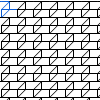][2x2_7] | [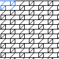][2x4_111] | [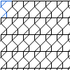][3x2_16] | 
|    | <a href="tl/3_5/2x2_7.txt" download="2x2_7.txt">2x2_7</a> | <a href="tl/3_5/2x4_111.txt" download="2x4_111.txt">2x4_111</a> | <a href="tl/3_5/3x2_16.txt" download="3x2_16.txt">3x2_16</a> | 
| B: |[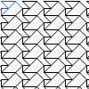][2x3_5] | [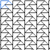][2x3_10] | [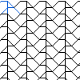][2x3_12] | B': | [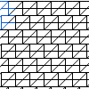][4x2_174] | 
|    |<a href="tl/3_5/2x3_5.txt" download="2x3_5.txt">2x3_5</a> | <a href="tl/3_5/2x3_10.txt" download="2x3_10.txt">2x3_10</a> | <a href="tl/3_5/2x3_12.txt" download="2x3_12.txt">2x3_12</a> |  | <a href="tl/3_5/4x2_174.txt" download="4x2_174.txt">4x2_174</a>
|C: |[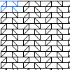][2x4_74] | [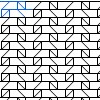][2x4_105] | [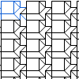][3x4_364] | [][3x4_444]
|   |<a href="tl/3_5/2x4_74.txt" download="2x4_74.txt">2x4_74</a> | <a href="tl/3_5/2x4_105.txt" download="2x4_105.txt">2x4_105</a> | <a href="tl/3_5/3x4_364.txt" download="3x4_364.txt">3x4_364</a> | <a href="tl/3_5/3x4_444.txt" download="3x4_444.txt">3x4_444</a>
|Other: |[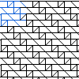][4x4_41] | 
|   |<a href="tl/3_5/4x4_41.txt" download="4x4_41.txt">4x4_41</a> | 

3, 4 and 5
----------

|     |     |     |     |     |
|:---|:---|:---|:---|:---|
[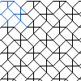][pinwheel] | [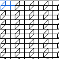][2x3_22] | [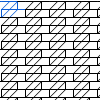][2x3_23] | [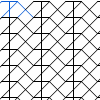][2x4_10] | [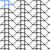][2x4_11]
<a href="tl/3_4_5/pinwheel.txt" download="pinwheel.txt">pinwheel</a> | <a href="tl/3_4_5/2x3_22.txt" download="2x3_22.txt">2x3_22</a> | <a href="tl/3_4_5/2x3_23.txt" download="2x3_23.txt">2x3_23</a> | <a href="tl/3_4_5/2x4_10.txt" download="2x4_10.txt">2x4_10</a> | <a href="tl/3_4_5/2x4_11.txt" download="2x4_11.txt">2x4_11</a>
[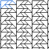][2x4_33] | [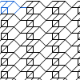][2x4_83] |  [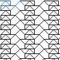][2x5_385] | [][2x5_425] | [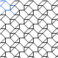][3x3_12]
<a href="tl/3_4_5/2x4_33.txt" download="2x4_33.txt">2x4_33</a> | <a href="tl/3_4_5/2x4_83.txt" download="2x4_83.txt">2x4_83</a> | <a href="tl/3_4_5/2x5_385.txt" download="2x5_385.txt">2x5_385</a> | <a href="tl/3_4_5/2x5_425.txt" download="2x5_425.txt">2x5_425</a> | <a href="tl/3_4_5/3x3_12.txt" download="3x3_12.txt">3x3_12</a>
[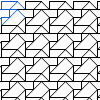][3x3_60] | [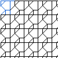][3x3_129] | [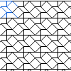][3x3_228] | [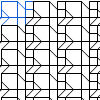][3x4_21] | [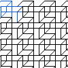][3x4_224]
<a href="tl/3_4_5/3x3_60.txt" download="3x3_60.txt">3x3_60</a> | <a href="tl/3_4_5/3x3_129.txt" download="3x3_129.txt">3x3_129</a> | <a href="tl/3_4_5/3x3_228.txt" download="3x3_228.txt">3x3_228</a> | <a href="tl/3_4_5/3x4_21.txt" download="3x4_21.txt">3x4_21</a> |<a href="tl/3_4_5/3x4_224.txt" download="3x4_224.txt">3x4_224</a>
[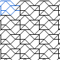][3x4_229] | [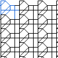][3x4_308] | [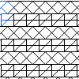][4x2_140] | [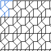][4x3_238] | [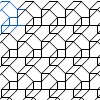][4x3_292]
<a href="tl/3_4_5/3x4_229.txt" download="3x4_229.txt">3x4_229</a> | <a href="tl/3_4_5/3x4_308.txt" download="3x4_308.txt">3x4_308</a> | <a href="tl/3_4_5/4x2_140.txt" download="4x2_140.txt">4x2_140</a> | <a href="tl/3_4_5/4x3_238.txt" download="4x3_238.txt">4x3_238</a> | <a href="tl/3_4_5/4x3_292.txt" download="4x3_292.txt">4x3_292</a>
[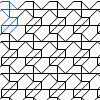][4x3_299] | [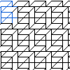][4x3_305] | [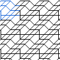][4x4_5] | [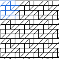][4x4_7] | [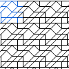][4x4_8]
<a href="tl/3_4_5/4x3_299.txt" download="4x3_299.txt">4x3_299</a> | <a href="tl/3_4_5/4x3_305.txt" download="4x3_305.txt">4x3_305</a> | <a href="tl/3_4_5/4x4_5.txt" download="4x4_5.txt">4x4_5</a> | <a href="tl/3_4_5/4x4_7.txt" download="4x4_7.txt">4x4_7</a> | <a href="tl/3_4_5/4x4_8.txt" download="4x4_8.txt">4x4_8</a>
[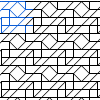][4x4_9] | [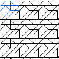][4x4_10] | [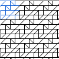][4x4_11] | [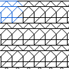][4x4_12] | [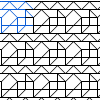][4x4_13]
<a href="tl/3_4_5/4x4_9.txt" download="4x4_9.txt">4x4_9</a> | <a href="tl/3_4_5/4x4_10.txt" download="4x4_10.txt">4x4_10</a> | <a href="tl/3_4_5/4x4_11.txt" download="4x4_11.txt">4x4_11</a> | <a href="tl/3_4_5/4x4_12.txt" download="4x4_12.txt">4x4_12</a> | <a href="tl/3_4_5/4x4_13.txt" download="4x4_13.txt">4x4_13</a>
[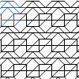][4x4_15] | [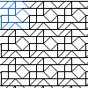][4x4_21] | [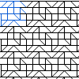][4x4_22] | [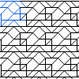][4x4_23] | [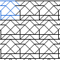][4x4_24]
<a href="tl/3_4_5/4x4_15.txt" download="4x4_15.txt">4x4_15</a> | <a href="tl/3_4_5/4x4_21.txt" download="4x4_21.txt">4x4_21</a> | <a href="tl/3_4_5/4x4_22.txt" download="4x4_22.txt">4x4_22</a> | <a href="tl/3_4_5/4x4_23.txt" download="4x4_23.txt">4x4_23</a> | <a href="tl/3_4_5/4x4_24.txt" download="4x4_24.txt">4x4_24</a>
[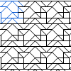][4x4_25] | [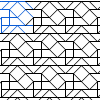][4x4_27] | [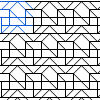][4x4_28] | [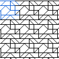][4x4_30] | [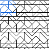][4x4_31]
<a href="tl/3_4_5/4x4_25.txt" download="4x4_25.txt">4x4_25</a> | <a href="tl/3_4_5/4x4_27.txt" download="4x4_27.txt">4x4_27</a> | <a href="tl/3_4_5/4x4_28.txt" download="4x4_28.txt">4x4_28</a> | <a href="tl/3_4_5/4x4_30.txt" download="4x4_30.txt">4x4_30</a> | <a href="tl/3_4_5/4x4_31.txt" download="4x4_31.txt">4x4_31</a>
[][4x4_34] | [][4x4_35] | [][4x4_42] | [][4x4_43] | [][4x4_44]
<a href="tl/3_4_5/4x4_34.txt" download="4x4_34.txt">4x4_34</a> | <a href="tl/3_4_5/4x4_35.txt" download="4x4_35.txt">4x4_35</a> | <a href="tl/3_4_5/4x4_42.txt" download="4x4_42.txt">4x4_42</a> | <a href="tl/3_4_5/4x4_43.txt" download="4x4_43.txt">4x4_43</a> | <a href="tl/3_4_5/4x4_44.txt" download="4x4_44.txt">4x4_44</a>
[][4x4_45] | [][4x4_84] | [][4x4_85] | [][4x4_86] | [][4x4_88]
<a href="tl/3_4_5/4x4_45.txt" download="4x4_45.txt">4x4_45</a> | <a href="tl/3_4_5/4x4_84.txt" download="4x4_84.txt">4x4_84</a> | <a href="tl/3_4_5/4x4_85.txt" download="4x4_85.txt">4x4_85</a> | <a href="tl/3_4_5/4x4_86.txt" download="4x4_86.txt">4x4_86</a> | <a href="tl/3_4_5/4x4_88.txt" download="4x4_88.txt">4x4_88</a>
[][4x4_92] | [][4x4_99] | [][4x4_120] | [][4x4_124] | [][4x4_140]
<a href="tl/3_4_5/4x4_92.txt" download="4x4_92.txt">4x4_92</a> | <a href="tl/3_4_5/4x4_99.txt" download="4x4_99.txt">4x4_99</a> | <a href="tl/3_4_5/4x4_120.txt" download="4x4_120.txt">4x4_120</a> | <a href="tl/3_4_5/4x4_124.txt" download="4x4_124.txt">4x4_124</a> | <a href="tl/3_4_5/4x4_140.txt" download="4x4_140.txt">4x4_140</a> 
[][4x4_150] | [][4x4_152] | [][4x4_153] | [][4x4_155] | [][4x4_193]
<a href="tl/3_4_5/4x4_150.txt" download="4x4_150.txt">4x4_150</a> | <a href="tl/3_4_5/4x4_152.txt" download="4x4_152.txt">4x4_152</a> | <a href="tl/3_4_5/4x4_153.txt" download="4x4_153.txt">4x4_153</a> | <a href="tl/3_4_5/4x4_155.txt" download="4x4_155.txt">4x4_155</a> | <a href="tl/3_4_5/4x4_193.txt" download="4x4_193.txt">4x4_193</a> |

[2x2_7]: /GroundForge/tiles.html?patchWidth=12&patchHeight=12&tile=43,68&shiftColsSW=0&shiftRowsSW=2&shiftColsSE=2&shiftRowsSE=0&
[2x3_10]: /GroundForge/tiles.html?patchWidth=12&patchHeight=12&tile=4-O,7E-&shiftColsSW=0&shiftRowsSW=2&shiftColsSE=3&shiftRowsSE=0&
[2x3_12]: /GroundForge/tiles.html?patchWidth=12&patchHeight=12&tile=58-,-15&shiftColsSW=0&shiftRowsSW=2&shiftColsSE=3&shiftRowsSE=0&
[2x3_5]: /GroundForge/tiles.html?patchWidth=12&patchHeight=12&tile=4-L,25-&shiftColsSW=0&shiftRowsSW=2&shiftColsSE=3&shiftRowsSE=0&
[2x4_105]: /GroundForge/tiles.html?patchWidth=12&patchHeight=12&tile=4832,6317&shiftColsSW=0&shiftRowsSW=2&shiftColsSE=4&shiftRowsSE=0&
[2x4_111]: /GroundForge/tiles.html?patchWidth=12&patchHeight=12&tile=4863,6348&shiftColsSW=0&shiftRowsSW=2&shiftColsSE=4&shiftRowsSE=0&
[2x4_74]: /GroundForge/tiles.html?patchWidth=12&patchHeight=12&tile=4312,6837&shiftColsSW=0&shiftRowsSW=2&shiftColsSE=4&shiftRowsSE=0&
[3x2_16]: /GroundForge/tiles.html?patchWidth=12&patchHeight=12&tile=68,4-,-5&shiftColsSW=0&shiftRowsSW=3&shiftColsSE=2&shiftRowsSE=0&
[3x4_364]: /GroundForge/tiles.html?patchWidth=12&patchHeight=12&tile=7-J7,8--7,F-B0&shiftColsSW=0&shiftRowsSW=3&shiftColsSE=4&shiftRowsSE=0&
[3x4_444]: /GroundForge/tiles.html?patchWidth=12&patchHeight=12&tile=5-M9,7-4-,-51E&shiftColsSW=0&shiftRowsSW=3&shiftColsSE=4&shiftRowsSE=0&
[4x2_174]: /GroundForge/tiles.html?patchWidth=12&patchHeight=12&tile=43,68,34,86&shiftColsSW=0&shiftRowsSW=4&shiftColsSE=2&shiftRowsSE=0&
[4x4_41]: /GroundForge/tiles.html?patchWidth=12&patchHeight=12&tile=4832,2483,3248,8324&shiftColsSW=0&shiftRowsSW=4&shiftColsSE=4&shiftRowsSE=0&

[2x3_22]: /GroundForge/tiles.html?patchWidth=12&patchHeight=12&tile=431,688&shiftColsSW=0&shiftRowsSW=2&shiftColsSE=3&shiftRowsSE=0&
[2x3_23]: /GroundForge/tiles.html?patchWidth=12&patchHeight=12&tile=463,668&shiftColsSW=0&shiftRowsSW=2&shiftColsSE=3&shiftRowsSE=0&
[2x4_10]: /GroundForge/tiles.html?patchWidth=12&patchHeight=12&tile=586-,-4-5&shiftColsSW=0&shiftRowsSW=2&shiftColsSE=4&shiftRowsSE=0&
[2x4_11]: /GroundForge/tiles.html?patchWidth=12&patchHeight=12&tile=588-,-115&shiftColsSW=0&shiftRowsSW=2&shiftColsSE=4&shiftRowsSE=0&
[2x4_33]: /GroundForge/tiles.html?patchWidth=12&patchHeight=12&tile=4-O9,70E-&shiftColsSW=0&shiftRowsSW=2&shiftColsSE=4&shiftRowsSE=0&
[2x4_83]: /GroundForge/tiles.html?patchWidth=12&patchHeight=12&tile=486-,66-5&shiftColsSW=0&shiftRowsSW=2&shiftColsSE=4&shiftRowsSE=0&
[2x5_385]: /GroundForge/tiles.html?patchWidth=12&patchHeight=12&tile=435-2,5376-&shiftColsSW=0&shiftRowsSW=2&shiftColsSE=5&shiftRowsSE=0&
[2x5_425]: /GroundForge/tiles.html?patchWidth=12&patchHeight=12&tile=43531,63588&shiftColsSW=0&shiftRowsSW=2&shiftColsSE=5&shiftRowsSE=0&
[3x3_12]: /GroundForge/tiles.html?patchWidth=12&patchHeight=12&tile=58-,6-5,-24&shiftColsSW=0&shiftRowsSW=3&shiftColsSE=3&shiftRowsSE=0&
[3x3_129]: /GroundForge/tiles.html?patchWidth=12&patchHeight=12&tile=688,4--,-2B&shiftColsSW=0&shiftRowsSW=3&shiftColsSE=3&shiftRowsSE=0&
[3x3_228]: /GroundForge/tiles.html?patchWidth=12&patchHeight=12&tile=583,24-,-25&shiftColsSW=0&shiftRowsSW=3&shiftColsSE=3&shiftRowsSE=0&
[3x3_60]: /GroundForge/tiles.html?patchWidth=12&patchHeight=12&tile=4-L,763,24-&shiftColsSW=0&shiftRowsSW=3&shiftColsSE=3&shiftRowsSE=0&
[3x4_21]: /GroundForge/tiles.html?patchWidth=12&patchHeight=12&tile=6-M4,8--7,12A1&shiftColsSW=0&shiftRowsSW=3&shiftColsSE=4&shiftRowsSE=0&
[3x4_224]: /GroundForge/tiles.html?patchWidth=12&patchHeight=12&tile=4-M-,301B,8886&shiftColsSW=0&shiftRowsSW=3&shiftColsSE=4&shiftRowsSE=0&
[3x4_229]: /GroundForge/tiles.html?patchWidth=12&patchHeight=12&tile=435-,6-25,86-5&shiftColsSW=0&shiftRowsSW=3&shiftColsSE=4&shiftRowsSE=0&
[3x4_308]: /GroundForge/tiles.html?patchWidth=12&patchHeight=12&tile=46--,4-2A,8688&shiftColsSW=0&shiftRowsSW=3&shiftColsSE=4&shiftRowsSE=0&
[4x2_140]: /GroundForge/tiles.html?patchWidth=12&patchHeight=12&tile=43,5-,35,86&shiftColsSW=0&shiftRowsSW=4&shiftColsSE=2&shiftRowsSE=0&
[4x3_238]: /GroundForge/tiles.html?patchWidth=12&patchHeight=12&tile=68D,-4-,B-2,-5-&shiftColsSW=0&shiftRowsSW=4&shiftColsSE=3&shiftRowsSE=0&
[4x3_292]: /GroundForge/tiles.html?patchWidth=12&patchHeight=12&tile=46-,6-5,-24,688&shiftColsSW=0&shiftRowsSW=4&shiftColsSE=3&shiftRowsSE=0&
[4x3_299]: /GroundForge/tiles.html?patchWidth=12&patchHeight=12&tile=46-,315,-76,668&shiftColsSW=0&shiftRowsSW=4&shiftColsSE=3&shiftRowsSE=0&
[4x3_305]: /GroundForge/tiles.html?patchWidth=12&patchHeight=12&tile=4-M,304,4-L,868&shiftColsSW=0&shiftRowsSW=4&shiftColsSE=3&shiftRowsSE=0&
[4x4_10]: /GroundForge/tiles.html?patchWidth=12&patchHeight=12&tile=4631,6317,6-76,8666&shiftColsSW=0&shiftRowsSW=4&shiftColsSE=4&shiftRowsSE=0&
[4x4_11]: /GroundForge/tiles.html?patchWidth=12&patchHeight=12&tile=4631,6317,3176,8866&shiftColsSW=0&shiftRowsSW=4&shiftColsSE=4&shiftRowsSE=0&
[4x4_12]: /GroundForge/tiles.html?patchWidth=12&patchHeight=12&tile=4343,5353,5-5-,8686&shiftColsSW=0&shiftRowsSW=4&shiftColsSE=4&shiftRowsSE=0&
[4x4_120]: /GroundForge/tiles.html?patchWidth=12&patchHeight=12&tile=68DD,-4--,B-2A,-5--&shiftColsSW=0&shiftRowsSW=4&shiftColsSE=4&shiftRowsSE=0&
[4x4_124]: /GroundForge/tiles.html?patchWidth=12&patchHeight=12&tile=6868,-4-4,5-5-,-5-5&shiftColsSW=0&shiftRowsSW=4&shiftColsSE=4&shiftRowsSE=0&
[4x4_13]: /GroundForge/tiles.html?patchWidth=12&patchHeight=12&tile=4343,5353,5-21,8688&shiftColsSW=0&shiftRowsSW=4&shiftColsSE=4&shiftRowsSE=0&
[4x4_140]: /GroundForge/tiles.html?patchWidth=12&patchHeight=12&tile=586-,-4-5,5-5-,-5-5&shiftColsSW=0&shiftRowsSW=4&shiftColsSE=4&shiftRowsSE=0&
[4x4_15]: /GroundForge/tiles.html?patchWidth=12&patchHeight=12&tile=434-,6325,6-25,8686&shiftColsSW=0&shiftRowsSW=4&shiftColsSE=4&shiftRowsSE=0&
[4x4_150]: /GroundForge/tiles.html?patchWidth=12&patchHeight=12&tile=586-,-115,588-,-4-5&shiftColsSW=0&shiftRowsSW=4&shiftColsSE=4&shiftRowsSE=0&
[4x4_152]: /GroundForge/tiles.html?patchWidth=12&patchHeight=12&tile=586-,-115,5-7-,-5-5&shiftColsSW=0&shiftRowsSW=4&shiftColsSE=4&shiftRowsSE=0&
[4x4_153]: /GroundForge/tiles.html?patchWidth=12&patchHeight=12&tile=586-,1112,788-,-4-5&shiftColsSW=0&shiftRowsSW=4&shiftColsSE=4&shiftRowsSE=0&
[4x4_155]: /GroundForge/tiles.html?patchWidth=12&patchHeight=12&tile=586-,1112,7-7-,-5-5&shiftColsSW=0&shiftRowsSW=4&shiftColsSE=4&shiftRowsSE=0&
[4x4_193]: /GroundForge/tiles.html?patchWidth=12&patchHeight=12&tile=588-,-115,588-,-115&shiftColsSW=0&shiftRowsSW=4&shiftColsSE=4&shiftRowsSE=0&
[4x4_21]: /GroundForge/tiles.html?patchWidth=12&patchHeight=12&tile=4632,5683,214-,8835&shiftColsSW=0&shiftRowsSW=4&shiftColsSE=4&shiftRowsSE=0&
[4x4_22]: /GroundForge/tiles.html?patchWidth=12&patchHeight=12&tile=4632,5683,2111,8837&shiftColsSW=0&shiftRowsSW=4&shiftColsSE=4&shiftRowsSE=0&
[4x4_23]: /GroundForge/tiles.html?patchWidth=12&patchHeight=12&tile=4632,56-2,6-58,8634&shiftColsSW=0&shiftRowsSW=4&shiftColsSE=4&shiftRowsSE=0&
[4x4_24]: /GroundForge/tiles.html?patchWidth=12&patchHeight=12&tile=4632,56-2,5-5-,8635&shiftColsSW=0&shiftRowsSW=4&shiftColsSE=4&shiftRowsSE=0&
[4x4_25]: /GroundForge/tiles.html?patchWidth=12&patchHeight=12&tile=4632,56-2,5-21,8637&shiftColsSW=0&shiftRowsSW=4&shiftColsSE=4&shiftRowsSE=0&
[4x4_27]: /GroundForge/tiles.html?patchWidth=12&patchHeight=12&tile=4632,56-2,215-,8835&shiftColsSW=0&shiftRowsSW=4&shiftColsSE=4&shiftRowsSE=0&
[4x4_28]: /GroundForge/tiles.html?patchWidth=12&patchHeight=12&tile=4632,56-2,2121,8837&shiftColsSW=0&shiftRowsSW=4&shiftColsSE=4&shiftRowsSE=0&
[4x4_30]: /GroundForge/tiles.html?patchWidth=12&patchHeight=12&tile=4632,5312,6-78,8634&shiftColsSW=0&shiftRowsSW=4&shiftColsSE=4&shiftRowsSE=0&
[4x4_31]: /GroundForge/tiles.html?patchWidth=12&patchHeight=12&tile=4632,5312,5-7-,8635&shiftColsSW=0&shiftRowsSW=4&shiftColsSE=4&shiftRowsSE=0&
[4x4_34]: /GroundForge/tiles.html?patchWidth=12&patchHeight=12&tile=5631,66-7,6-56,-566&shiftColsSW=0&shiftRowsSW=4&shiftColsSE=4&shiftRowsSE=0&
[4x4_35]: /GroundForge/tiles.html?patchWidth=12&patchHeight=12&tile=5631,66-7,3156,-766&shiftColsSW=0&shiftRowsSW=4&shiftColsSE=4&shiftRowsSE=0&
[4x4_42]: /GroundForge/tiles.html?patchWidth=12&patchHeight=12&tile=4832,2483,224-,8325&shiftColsSW=0&shiftRowsSW=4&shiftColsSE=4&shiftRowsSE=0&
[4x4_43]: /GroundForge/tiles.html?patchWidth=12&patchHeight=12&tile=486-,-4-5,5-5-,86-5&shiftColsSW=0&shiftRowsSW=4&shiftColsSE=4&shiftRowsSE=0&
[4x4_44]: /GroundForge/tiles.html?patchWidth=12&patchHeight=12&tile=486-,-4-5,5-21,86-7&shiftColsSW=0&shiftRowsSW=4&shiftColsSE=4&shiftRowsSE=0&
[4x4_45]: /GroundForge/tiles.html?patchWidth=12&patchHeight=12&tile=4832,24-2,225-,8325&shiftColsSW=0&shiftRowsSW=4&shiftColsSE=4&shiftRowsSE=0&
[4x4_5]: /GroundForge/tiles.html?patchWidth=12&patchHeight=12&tile=466-,66-5,6-56,8666&shiftColsSW=0&shiftRowsSW=4&shiftColsSE=4&shiftRowsSE=0&
[4x4_7]: /GroundForge/tiles.html?patchWidth=12&patchHeight=12&tile=4631,6688,3146,8866&shiftColsSW=0&shiftRowsSW=4&shiftColsSE=4&shiftRowsSE=0&
[4x4_8]: /GroundForge/tiles.html?patchWidth=12&patchHeight=12&tile=4631,66-7,6-56,8666&shiftColsSW=0&shiftRowsSW=4&shiftColsSE=4&shiftRowsSE=0&
[4x4_84]: /GroundForge/tiles.html?patchWidth=12&patchHeight=12&tile=4353,5353,6-58,86-4&shiftColsSW=0&shiftRowsSW=4&shiftColsSE=4&shiftRowsSE=0&
[4x4_85]: /GroundForge/tiles.html?patchWidth=12&patchHeight=12&tile=4353,5353,5-5-,86-5&shiftColsSW=0&shiftRowsSW=4&shiftColsSE=4&shiftRowsSE=0&
[4x4_86]: /GroundForge/tiles.html?patchWidth=12&patchHeight=12&tile=4353,5353,5-21,86-7&shiftColsSW=0&shiftRowsSW=4&shiftColsSE=4&shiftRowsSE=0&
[4x4_88]: /GroundForge/tiles.html?patchWidth=12&patchHeight=12&tile=435-,6325,6-25,86-5&shiftColsSW=0&shiftRowsSW=4&shiftColsSE=4&shiftRowsSE=0&
[4x4_9]: /GroundForge/tiles.html?patchWidth=12&patchHeight=12&tile=4631,66-7,3156,8866&shiftColsSW=0&shiftRowsSW=4&shiftColsSE=4&shiftRowsSE=0&
[4x4_92]: /GroundForge/tiles.html?patchWidth=12&patchHeight=12&tile=5632,56-2,6-58,-534&shiftColsSW=0&shiftRowsSW=4&shiftColsSE=4&shiftRowsSE=0&
[4x4_99]: /GroundForge/tiles.html?patchWidth=12&patchHeight=12&tile=CD6-,---5,2AB-,---5&shiftColsSW=0&shiftRowsSW=4&shiftColsSE=4&shiftRowsSE=0&
[pinwheel]: /GroundForge/tiles.html?patchWidth=12&patchHeight=12&tile=586-,-4-5,5-21,-5-7&shiftColsSW=0&shiftRowsSW=4&shiftColsSE=4&shiftRowsSE=0&
