[TesseLace.com]: https://tesselace.com
[GroundForge]: /GroundForge/tiles.html

Hexagon holes
===================

 

3, 4 and 6
----------

|     |     |     |     |     |
|:---|:---|:---|:---|:---|
[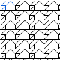][2x3_25] | [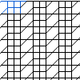][2x4_8] | [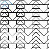][2x4_50] | [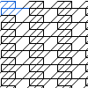][2x4_67] | [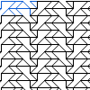][2x5_9]
<a href="tl/3_4_6/2x3_25.txt" download="2x3_25.txt">2x3_25</a> | <a href="tl/3_4_6/2x4_8.txt" download="2x4_8.txt">2x4_8</a> | <a href="tl/3_4_6/2x4_50.txt" download="2x4_50.txt">2x4_50</a> | <a href="tl/3_4_6/2x4_67.txt" download="2x4_67.txt">2x4_67</a> | <a href="tl/3_4_6/2x5_9.txt" download="2x5_9.txt">2x5_9</a>
[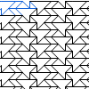][2x5_485] | [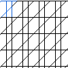][3x3_117] | [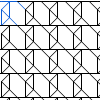][3x3_169] | [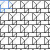][3x3_276] | [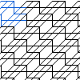][4x4_2]
<a href="tl/3_4_6/2x5_485.txt" download="2x5_485.txt">2x5_485</a> | <a href="tl/3_4_6/3x3_117.txt" download="3x3_117.txt">3x3_117</a> | <a href="tl/3_4_6/3x3_169.txt" download="3x3_169.txt">3x3_169</a> | <a href="tl/3_4_6/3x3_276.txt" download="3x3_276.txt">3x3_276</a> | <a href="tl/3_4_6/4x4_2.txt" download="4x4_2.txt">4x4_2</a>
[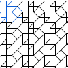][4x4_39] | [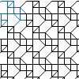][4x4_40] | [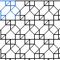][4x4_54] | [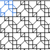][4x4_55] | [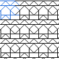][4x4_90]
<a href="tl/3_4_6/4x4_39.txt" download="4x4_39.txt">4x4_39</a> | <a href="tl/3_4_6/4x4_40.txt" download="4x4_40.txt">4x4_40</a> | <a href="tl/3_4_6/4x4_54.txt" download="4x4_54.txt">4x4_54</a> | <a href="tl/3_4_6/4x4_55.txt" download="4x4_55.txt">4x4_55</a> | <a href="tl/3_4_6/4x4_90.txt" download="4x4_90.txt">4x4_90</a>
[][4x4_91] | [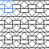][4x4_94] | [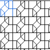][4x4_103] | [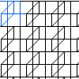][4x4_104] | [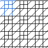][4x4_128]
<a href="tl/3_4_6/4x4_91.txt" download="4x4_91.txt">4x4_91</a> | <a href="tl/3_4_6/4x4_94.txt" download="4x4_94.txt">4x4_94</a> | <a href="tl/3_4_6/4x4_103.txt" download="4x4_103.txt">4x4_103</a> | <a href="tl/3_4_6/4x4_104.txt" download="4x4_104.txt">4x4_104</a> | <a href="tl/3_4_6/4x4_128.txt" download="4x4_128.txt">4x4_128</a>
[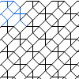][4x4_139] | [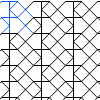][4x4_143] | [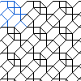][4x4_151] | [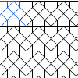][4x4_158] | [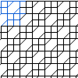][4x4_184]
<a href="tl/3_4_6/4x4_139.txt" download="4x4_139.txt">4x4_139</a> | <a href="tl/3_4_6/4x4_143.txt" download="4x4_143.txt">4x4_143</a> | <a href="tl/3_4_6/4x4_151.txt" download="4x4_151.txt">4x4_151</a> | <a href="tl/3_4_6/4x4_158.txt" download="4x4_158.txt">4x4_158</a> | <a href="tl/3_4_6/4x4_184.txt" download="4x4_184.txt">4x4_184</a>
[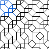][4x4_198] | [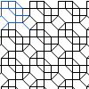][4x4_200] | [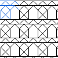][4x4_213] | [][4x4_214] | [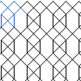][4x4_215]
<a href="tl/3_4_6/4x4_198.txt" download="4x4_198.txt">4x4_198</a> | <a href="tl/3_4_6/4x4_200.txt" download="4x4_200.txt">4x4_200</a> | <a href="tl/3_4_6/4x4_213.txt" download="4x4_213.txt">4x4_213</a> | <a href="tl/3_4_6/4x4_214.txt" download="4x4_214.txt">4x4_214</a> | <a href="tl/3_4_6/4x4_215.txt" download="4x4_215.txt">4x4_215</a>

3, 5 and 6
----------

|     |     |     |     |     |
|:---|:---|:---|:---|:---|
[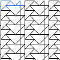][2x5_219] | [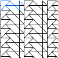][2x5_230] | [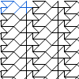][2x5_293] | [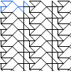][2x5_294] | [][2x5_296]
<a href="tl/3_5_6/2x5_219.txt" download="2x5_219.txt">2x5_219</a> | <a href="tl/3_5_6/2x5_230.txt" download="2x5_230.txt">2x5_230</a> | <a href="tl/3_5_6/2x5_293.txt" download="2x5_293.txt">2x5_293</a> | <a href="tl/3_5_6/2x5_294.txt" download="2x5_294.txt">2x5_294</a> | <a href="tl/3_5_6/2x5_296.txt" download="2x5_296.txt">2x5_296</a>
[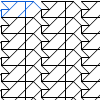][2x5_313] | [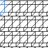][4x2_167] | [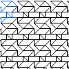][4x3_96]
<a href="tl/3_5_6/2x5_313.txt" download="2x5_313.txt">2x5_313</a> | <a href="tl/3_5_6/4x2_167.txt" download="4x2_167.txt">4x2_167</a> | <a href="tl/3_5_6/4x3_96.txt" download="4x3_96.txt">4x3_96</a>

3,4,5 and 6
-----------

|     |     |     |     |     |
|:---|:---|:---|:---|:---|
[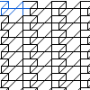][2x4_91] | [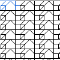][2x4_106] | [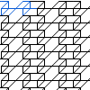][2x5_344] | [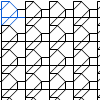][3x3_3] | [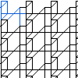][3x4_311]
<a href="tl/3_4_5_6/2x4_91.txt" download="2x4_91.txt">2x4_91</a> | <a href="tl/3_4_5_6/2x4_106.txt" download="2x4_106.txt">2x4_106</a> | <a href="tl/3_4_5_6/2x5_344.txt" download="2x5_344.txt">2x5_344</a> | <a href="tl/3_4_5_6/3x3_3.txt" download="3x3_3.txt">3x3_3</a> | <a href="tl/3_4_5_6/3x4_311.txt" download="3x4_311.txt">3x4_311</a>
[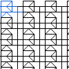][3x4_321] | [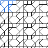][3x4_352] | [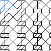][3x4_420] | [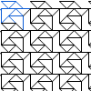][3x4_477] | [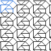][3x4_479]
<a href="tl/3_4_5_6/3x4_321.txt" download="3x4_321.txt">3x4_321</a> | <a href="tl/3_4_5_6/3x4_352.txt" download="3x4_352.txt">3x4_352</a> | <a href="tl/3_4_5_6/3x4_420.txt" download="3x4_420.txt">3x4_420</a> | <a href="tl/3_4_5_6/3x4_477.txt" download="3x4_477.txt">3x4_477</a> | <a href="tl/3_4_5_6/3x4_479.txt" download="3x4_479.txt">3x4_479</a>
[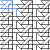][3x5_51] | [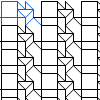][3x5_321] | [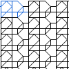][3x5_323] | [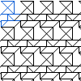][4x3_93] | [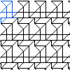][4x3_95]
<a href="tl/3_4_5_6/3x5_51.txt" download="3x5_51.txt">3x5_51</a> | <a href="tl/3_4_5_6/3x5_321.txt" download="3x5_321.txt">3x5_321</a> | <a href="tl/3_4_5_6/3x5_323.txt" download="3x5_323.txt">3x5_323</a> | <a href="tl/3_4_5_6/4x3_93.txt" download="4x3_93.txt">4x3_93</a> | <a href="tl/3_4_5_6/4x3_95.txt" download="4x3_95.txt">4x3_95</a>
[][4x3_297] | [][4x4_18] | [][4x4_20] | [][4x4_26] | [][4x4_29]
<a href="tl/3_4_5_6/4x3_297.txt" download="4x3_297.txt">4x3_297</a> | <a href="tl/3_4_5_6/4x4_18.txt" download="4x4_18.txt">4x4_18</a> | <a href="tl/3_4_5_6/4x4_20.txt" download="4x4_20.txt">4x4_20</a> | <a href="tl/3_4_5_6/4x4_26.txt" download="4x4_26.txt">4x4_26</a> | <a href="tl/3_4_5_6/4x4_29.txt" download="4x4_29.txt">4x4_29</a>
[][4x4_32] | [][4x4_38] | [][4x4_60] | [][4x4_68] | [][4x4_107]
<a href="tl/3_4_5_6/4x4_32.txt" download="4x4_32.txt">4x4_32</a> | <a href="tl/3_4_5_6/4x4_38.txt" download="4x4_38.txt">4x4_38</a> | <a href="tl/3_4_5_6/4x4_60.txt" download="4x4_60.txt">4x4_60</a> | <a href="tl/3_4_5_6/4x4_68.txt" download="4x4_68.txt">4x4_68</a> | <a href="tl/3_4_5_6/4x4_107.txt" download="4x4_107.txt">4x4_107</a>
[][4x4_108] | [][4x4_112] | [][4x4_137] | [][4x4_144] | [][4x4_196] 
<a href="tl/3_4_5_6/4x4_108.txt" download="4x4_108.txt">4x4_108</a> | <a href="tl/3_4_5_6/4x4_112.txt" download="4x4_112.txt">4x4_112</a> | <a href="tl/3_4_5_6/4x4_137.txt" download="4x4_137.txt">4x4_137</a> | <a href="tl/3_4_5_6/4x4_144.txt" download="4x4_144.txt">4x4_144</a> | <a href="tl/3_4_5_6/4x4_196.txt" download="4x4_196.txt">4x4_196</a>

[2x3_25]: /GroundForge/tiles.html?patchWidth=12&patchHeight=12&tile=483,56-&shiftColsSW=0&shiftRowsSW=2&shiftColsSE=3&shiftRowsSE=0&
[2x4_50]: /GroundForge/tiles.html?patchWidth=12&patchHeight=12&tile=437-,6325&shiftColsSW=0&shiftRowsSW=2&shiftColsSE=4&shiftRowsSE=0&
[2x4_67]: /GroundForge/tiles.html?patchWidth=12&patchHeight=12&tile=466-,6686&shiftColsSW=0&shiftRowsSW=2&shiftColsSE=4&shiftRowsSE=0&
[2x4_8]: /GroundForge/tiles.html?patchWidth=12&patchHeight=12&tile=6888,-114&shiftColsSW=0&shiftRowsSW=2&shiftColsSE=4&shiftRowsSE=0&
[2x5_485]: /GroundForge/tiles.html?patchWidth=12&patchHeight=12&tile=4-O90,90E-7&shiftColsSW=0&shiftRowsSW=2&shiftColsSE=5&shiftRowsSE=0&
[2x5_9]: /GroundForge/tiles.html?patchWidth=12&patchHeight=12&tile=6-O94,70E-2&shiftColsSW=0&shiftRowsSW=2&shiftColsSE=5&shiftRowsSE=0&
[3x3_117]: /GroundForge/tiles.html?patchWidth=12&patchHeight=12&tile=68D,--4,-B-&shiftColsSW=0&shiftRowsSW=3&shiftColsSE=3&shiftRowsSE=0&
[3x3_169]: /GroundForge/tiles.html?patchWidth=12&patchHeight=12&tile=B32,5--,-C-&shiftColsSW=0&shiftRowsSW=3&shiftColsSE=3&shiftRowsSE=0&
[3x3_276]: /GroundForge/tiles.html?patchWidth=12&patchHeight=12&tile=483,5--,83B&shiftColsSW=0&shiftRowsSW=3&shiftColsSE=3&shiftRowsSE=0&
[4x4_103]: /GroundForge/tiles.html?patchWidth=12&patchHeight=12&tile=B83A,-4--,6-CD,-5--&shiftColsSW=0&shiftRowsSW=4&shiftColsSE=4&shiftRowsSE=0&
[4x4_104]: /GroundForge/tiles.html?patchWidth=12&patchHeight=12&tile=B83A,-4--,68DD,-4--&shiftColsSW=0&shiftRowsSW=4&shiftColsSE=4&shiftRowsSE=0&
[4x4_128]: /GroundForge/tiles.html?patchWidth=12&patchHeight=12&tile=6868,-114,6888,-4-4&shiftColsSW=0&shiftRowsSW=4&shiftColsSE=4&shiftRowsSE=0&
[4x4_139]: /GroundForge/tiles.html?patchWidth=12&patchHeight=12&tile=586-,-4-5,6-58,-5-4&shiftColsSW=0&shiftRowsSW=4&shiftColsSE=4&shiftRowsSE=0&
[4x4_143]: /GroundForge/tiles.html?patchWidth=12&patchHeight=12&tile=586-,-4-5,215-,-7-5&shiftColsSW=0&shiftRowsSW=4&shiftColsSE=4&shiftRowsSE=0&
[4x4_151]: /GroundForge/tiles.html?patchWidth=12&patchHeight=12&tile=586-,-115,6-78,-5-4&shiftColsSW=0&shiftRowsSW=4&shiftColsSE=4&shiftRowsSE=0&
[4x4_158]: /GroundForge/tiles.html?patchWidth=12&patchHeight=12&tile=5831,-4-7,5-5-,-5-5&shiftColsSW=0&shiftRowsSW=4&shiftColsSE=4&shiftRowsSE=0&
[4x4_184]: /GroundForge/tiles.html?patchWidth=12&patchHeight=12&tile=6888,14-1,8868,-114&shiftColsSW=0&shiftRowsSW=4&shiftColsSE=4&shiftRowsSE=0&
[4x4_198]: /GroundForge/tiles.html?patchWidth=12&patchHeight=12&tile=588-,14-2,8-58,-214&shiftColsSW=0&shiftRowsSW=4&shiftColsSE=4&shiftRowsSE=0&
[4x4_2]: /GroundForge/tiles.html?patchWidth=12&patchHeight=12&tile=466-,6686,6-46,8666&shiftColsSW=0&shiftRowsSW=4&shiftColsSE=4&shiftRowsSE=0&
[4x4_200]: /GroundForge/tiles.html?patchWidth=12&patchHeight=12&tile=588-,1112,8-78,-214&shiftColsSW=0&shiftRowsSW=4&shiftColsSE=4&shiftRowsSE=0&
[4x4_213]: /GroundForge/tiles.html?patchWidth=12&patchHeight=12&tile=B3C3,5353,5-5-,-5--&shiftColsSW=0&shiftRowsSW=4&shiftColsSE=4&shiftRowsSE=0&
[4x4_214]: /GroundForge/tiles.html?patchWidth=12&patchHeight=12&tile=B3C-,6325,6-25,-5--&shiftColsSW=0&shiftRowsSW=4&shiftColsSE=4&shiftRowsSE=0&
[4x4_215]: /GroundForge/tiles.html?patchWidth=12&patchHeight=12&tile=B-C-,-5-5,5-5-,-5--&shiftColsSW=0&shiftRowsSW=4&shiftColsSE=4&shiftRowsSE=0&
[4x4_39]: /GroundForge/tiles.html?patchWidth=12&patchHeight=12&tile=486-,-486,214-,88-5&shiftColsSW=0&shiftRowsSW=4&shiftColsSE=4&shiftRowsSE=0&
[4x4_40]: /GroundForge/tiles.html?patchWidth=12&patchHeight=12&tile=486-,-486,2111,88-7&shiftColsSW=0&shiftRowsSW=4&shiftColsSE=4&shiftRowsSE=0&
[4x4_54]: /GroundForge/tiles.html?patchWidth=12&patchHeight=12&tile=4831,-488,5-4-,86-5&shiftColsSW=0&shiftRowsSW=4&shiftColsSE=4&shiftRowsSE=0&
[4x4_55]: /GroundForge/tiles.html?patchWidth=12&patchHeight=12&tile=4831,-488,5-11,86-7&shiftColsSW=0&shiftRowsSW=4&shiftColsSE=4&shiftRowsSE=0&
[4x4_90]: /GroundForge/tiles.html?patchWidth=12&patchHeight=12&tile=4373,5353,5-5-,8315&shiftColsSW=0&shiftRowsSW=4&shiftColsSE=4&shiftRowsSE=0&
[4x4_91]: /GroundForge/tiles.html?patchWidth=12&patchHeight=12&tile=437-,6325,6-25,8315&shiftColsSW=0&shiftRowsSW=4&shiftColsSE=4&shiftRowsSE=0&
[4x4_94]: /GroundForge/tiles.html?patchWidth=12&patchHeight=12&tile=5632,56-2,3158,-734&shiftColsSW=0&shiftRowsSW=4&shiftColsSE=4&shiftRowsSE=0&

[2x5_219]: /GroundForge/tiles.html?patchWidth=12&patchHeight=12&tile=4-O-4,8E-58&shiftColsSW=0&shiftRowsSW=2&shiftColsSE=5&shiftRowsSE=0&
[2x5_230]: /GroundForge/tiles.html?patchWidth=12&patchHeight=12&tile=4-O-7,7E-21&shiftColsSW=0&shiftRowsSW=2&shiftColsSE=5&shiftRowsSE=0&
[2x5_293]: /GroundForge/tiles.html?patchWidth=12&patchHeight=12&tile=4-L-4,35-58&shiftColsSW=0&shiftRowsSW=2&shiftColsSE=5&shiftRowsSE=0&
[2x5_294]: /GroundForge/tiles.html?patchWidth=12&patchHeight=12&tile=4-L-7,25-21&shiftColsSW=0&shiftRowsSW=2&shiftColsSE=5&shiftRowsSE=0&
[2x5_296]: /GroundForge/tiles.html?patchWidth=12&patchHeight=12&tile=586-1,-4-58&shiftColsSW=0&shiftRowsSW=2&shiftColsSE=5&shiftRowsSE=0&
[2x5_313]: /GroundForge/tiles.html?patchWidth=12&patchHeight=12&tile=4-L86,25-4-&shiftColsSW=0&shiftRowsSW=2&shiftColsSE=5&shiftRowsSE=0&
[4x2_167]: /GroundForge/tiles.html?patchWidth=12&patchHeight=12&tile=43,68,-4,68&shiftColsSW=0&shiftRowsSW=4&shiftColsSE=2&shiftRowsSE=0&
[4x3_96]: /GroundForge/tiles.html?patchWidth=12&patchHeight=12&tile=4-L,O5-,430,317&shiftColsSW=0&shiftRowsSW=4&shiftColsSE=3&shiftRowsSE=0&

[2x4_106]: /GroundForge/tiles.html?patchWidth=12&patchHeight=12&tile=4831,66-7&shiftColsSW=0&shiftRowsSW=2&shiftColsSE=4&shiftRowsSE=0&
[2x4_91]: /GroundForge/tiles.html?patchWidth=12&patchHeight=12&tile=46-1,6868&shiftColsSW=0&shiftRowsSW=2&shiftColsSE=4&shiftRowsSE=0&
[2x5_344]: /GroundForge/tiles.html?patchWidth=12&patchHeight=12&tile=46-43,68668&shiftColsSW=0&shiftRowsSW=2&shiftColsSE=5&shiftRowsSE=0&
[3x3_3]: /GroundForge/tiles.html?patchWidth=12&patchHeight=12&tile=46-,4-2,868&shiftColsSW=0&shiftRowsSW=3&shiftColsSE=3&shiftRowsSE=0&
[3x4_311]: /GroundForge/tiles.html?patchWidth=12&patchHeight=12&tile=46--,4--A,8D68&shiftColsSW=0&shiftRowsSW=3&shiftColsSE=4&shiftRowsSE=0&
[3x4_321]: /GroundForge/tiles.html?patchWidth=12&patchHeight=12&tile=4-O-,101A,8378&shiftColsSW=0&shiftRowsSW=3&shiftColsSE=4&shiftRowsSE=0&
[3x4_352]: /GroundForge/tiles.html?patchWidth=12&patchHeight=12&tile=6889,4-11,-54-&shiftColsSW=0&shiftRowsSW=3&shiftColsSE=4&shiftRowsSE=0&
[3x4_420]: /GroundForge/tiles.html?patchWidth=12&patchHeight=12&tile=468-,-4-5,586-&shiftColsSW=0&shiftRowsSW=3&shiftColsSE=4&shiftRowsSE=0&
[3x4_477]: /GroundForge/tiles.html?patchWidth=12&patchHeight=12&tile=B-O-,353C,-E-5&shiftColsSW=0&shiftRowsSW=3&shiftColsSE=4&shiftRowsSE=0&
[3x4_479]: /GroundForge/tiles.html?patchWidth=12&patchHeight=12&tile=B-O8,256-,-E-5&shiftColsSW=0&shiftRowsSW=3&shiftColsSE=4&shiftRowsSE=0&
[3x5_321]: /GroundForge/tiles.html?patchWidth=12&patchHeight=12&tile=7-M4-,--179,G-151&shiftColsSW=0&shiftRowsSW=3&shiftColsSE=5&shiftRowsSE=0&
[3x5_323]: /GroundForge/tiles.html?patchWidth=12&patchHeight=12&tile=4314-,4-7-2,86868&shiftColsSW=0&shiftRowsSW=3&shiftColsSE=5&shiftRowsSE=0&
[3x5_51]: /GroundForge/tiles.html?patchWidth=12&patchHeight=12&tile=5-M8-,-501G,56883&shiftColsSW=0&shiftRowsSW=3&shiftColsSE=5&shiftRowsSE=0&
[4x3_297]: /GroundForge/tiles.html?patchWidth=12&patchHeight=12&tile=46-,6-5,--4,D68&shiftColsSW=0&shiftRowsSW=4&shiftColsSE=3&shiftRowsSE=0&
[4x3_93]: /GroundForge/tiles.html?patchWidth=12&patchHeight=12&tile=4-L,-5-,63C,315&shiftColsSW=0&shiftRowsSW=4&shiftColsSE=3&shiftRowsSE=0&
[4x3_95]: /GroundForge/tiles.html?patchWidth=12&patchHeight=12&tile=4-L,-5-,68D,314&shiftColsSW=0&shiftRowsSW=4&shiftColsSE=3&shiftRowsSE=0&
[4x4_107]: /GroundForge/tiles.html?patchWidth=12&patchHeight=12&tile=B8D-,-4-5,586-,-4--&shiftColsSW=0&shiftRowsSW=4&shiftColsSE=4&shiftRowsSE=0&
[4x4_108]: /GroundForge/tiles.html?patchWidth=12&patchHeight=12&tile=B8D-,-4-5,5-5-,-5--&shiftColsSW=0&shiftRowsSW=4&shiftColsSE=4&shiftRowsSE=0&
[4x4_112]: /GroundForge/tiles.html?patchWidth=12&patchHeight=12&tile=B8D-,---5,2AB-,-7--&shiftColsSW=0&shiftRowsSW=4&shiftColsSE=4&shiftRowsSE=0&
[4x4_137]: /GroundForge/tiles.html?patchWidth=12&patchHeight=12&tile=586-,-4-5,6868,-4-4&shiftColsSW=0&shiftRowsSW=4&shiftColsSE=4&shiftRowsSE=0&
[4x4_144]: /GroundForge/tiles.html?patchWidth=12&patchHeight=12&tile=586-,---5,2AB-,-7-5&shiftColsSW=0&shiftRowsSW=4&shiftColsSE=4&shiftRowsSE=0&
[4x4_18]: /GroundForge/tiles.html?patchWidth=12&patchHeight=12&tile=4632,5683,5-4-,8635&shiftColsSW=0&shiftRowsSW=4&shiftColsSE=4&shiftRowsSE=0&
[4x4_196]: /GroundForge/tiles.html?patchWidth=12&patchHeight=12&tile=588-,14-2,8868,-114&shiftColsSW=0&shiftRowsSW=4&shiftColsSE=4&shiftRowsSE=0&
[4x4_20]: /GroundForge/tiles.html?patchWidth=12&patchHeight=12&tile=4632,5683,3148,8834&shiftColsSW=0&shiftRowsSW=4&shiftColsSE=4&shiftRowsSE=0&
[4x4_26]: /GroundForge/tiles.html?patchWidth=12&patchHeight=12&tile=4632,56-2,3158,8834&shiftColsSW=0&shiftRowsSW=4&shiftColsSE=4&shiftRowsSE=0&
[4x4_29]: /GroundForge/tiles.html?patchWidth=12&patchHeight=12&tile=4632,56-2,5---,8D3B&shiftColsSW=0&shiftRowsSW=4&shiftColsSE=4&shiftRowsSE=0&
[4x4_32]: /GroundForge/tiles.html?patchWidth=12&patchHeight=12&tile=4632,5312,3178,8834&shiftColsSW=0&shiftRowsSW=4&shiftColsSE=4&shiftRowsSE=0&
[4x4_38]: /GroundForge/tiles.html?patchWidth=12&patchHeight=12&tile=486-,-486,5-11,86-7&shiftColsSW=0&shiftRowsSW=4&shiftColsSE=4&shiftRowsSE=0&
[4x4_60]: /GroundForge/tiles.html?patchWidth=12&patchHeight=12&tile=4831,-4-7,5-5-,86-5&shiftColsSW=0&shiftRowsSW=4&shiftColsSE=4&shiftRowsSE=0&
[4x4_68]: /GroundForge/tiles.html?patchWidth=12&patchHeight=12&tile=4831,-117,5-7-,86-5&shiftColsSW=0&shiftRowsSW=4&shiftColsSE=4&shiftRowsSE=0&
