[TesseLace.com]: https://tesselace.com
[GroundForge]: /GroundForge/tiles.html

Heptagon holes
===================

The grounds that appear in the TesseLace index are the result of research by [Veronika Irvine](https://tesselace.com/about) and were generated using the [TesseLace algorithm](https://tesselace.com/research/bridges2012/).  Some of these grounds are familiar, traditional grounds.  Others have not been found in known catalogues and are likely new.

In the following tables, 
* click on the **image** to see thread and pair diagrams in [GroundForge],
* click on the **name** to download a template file for use with the [Bobbin Lace plugins for Inkscape](https://tesselace.com/tools/inkscape-extension/).

Families of patterns are variations of the same pattern with [modified pin positions](/GroundForge/help/Reshape-Patterns).  Note: Currently, GroundForge does not support pin positions therefore the thread diagrams for all members of a family look the same.

3 and 7
-------

|     |     |     |     |     |
|:---|:---|:---|:---|:---|
[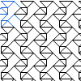][4x3_264] | [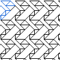][4x3_289]
<a href="tl/3_7/4x3_264.txt" download="4x3_264.txt">4x3_264</a> | <a href="tl/3_7/4x3_289.txt" download="4x3_289.txt">4x3_289</a>

3, 4 and 7
----------

|     |     |     |     |     |
|:---|:---|:---|:---|:---|
[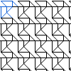][3x3_59] | [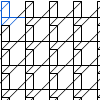][3x3_86] | [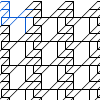][3x4_206] | [][3x4_262] |[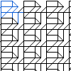][3x4_280]
<a href="tl/3_4_7/3x3_59.txt" download="3x3_59.txt">3x3_59</a> | <a href="tl/3_4_7/3x3_86.txt" download="3x3_86.txt">3x3_86</a> | <a href="tl/3_4_7/3x4_206.txt" download="3x4_206.txt">3x4_206</a> | <a href="tl/3_4_7/3x4_262.txt" download="3x4_262.txt">3x4_262</a> | <a href="tl/3_4_7/3x4_280.txt" download="3x4_280.txt">3x4_280</a>
[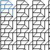][3x4_295] | [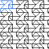][3x4_459] | [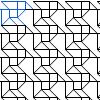][3x4_464] | [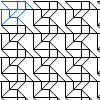][3x4_473] | [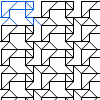][3x5_231]
<a href="tl/3_4_7/3x4_295.txt" download="3x4_295.txt">3x4_295</a> | <a href="tl/3_4_7/3x4_459.txt" download="3x4_459.txt">3x4_459</a> | <a href="tl/3_4_7/3x4_464.txt" download="3x4_464.txt">3x4_464</a> | <a href="tl/3_4_7/3x4_473.txt" download="3x4_473.txt">3x4_473</a> | <a href="tl/3_4_7/3x5_231.txt" download="3x5_231.txt">3x5_231</a>
[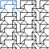][3x5_232] | [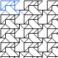][3x5_262] | [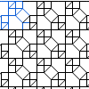][4x4_57] | [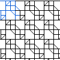][4x4_58] | [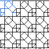][4x4_63]
<a href="tl/3_4_7/3x5_232.txt" download="3x5_232.txt">3x5_232</a> | <a href="tl/3_4_7/3x5_262.txt" download="3x5_262.txt">3x5_262</a> | <a href="tl/3_4_7/4x4_57.txt" download="4x4_57.txt">4x4_57</a> | <a href="tl/3_4_7/4x4_58.txt" download="4x4_58.txt">4x4_58</a> | <a href="tl/3_4_7/4x4_63.txt" download="4x4_63.txt">4x4_63</a>
[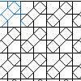][4x4_159] | [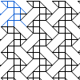][4x4_201]
<a href="tl/3_4_7/4x4_159.txt" download="4x4_159.txt">4x4_159</a> | <a href="tl/3_4_7/4x4_201.txt" download="4x4_201.txt">4x4_201</a>

3, 5 and 7
----------

|     |     |     |     |     |
|:---|:---|:---|:---|:---|
[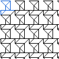][3x3_56] | [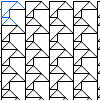][3x3_65] | [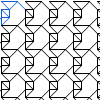][3x3_72] | [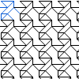][3x3_93] | [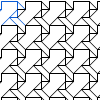][3x3_134]
<a href="tl/3_5_7/3x3_56.txt" download="3x3_56.txt">3x3_56</a> | <a href="tl/3_5_7/3x3_65.txt" download="3x3_65.txt">3x3_65</a> | <a href="tl/3_5_7/3x3_72.txt" download="3x3_72.txt">3x3_72</a> | <a href="tl/3_5_7/3x3_93.txt" download="3x3_93.txt">3x3_93</a> | <a href="tl/3_5_7/3x3_134.txt" download="3x3_134.txt">3x3_134</a>
[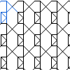][4x3_220] | [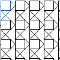][4x3_413] | [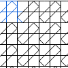][4x4_157] |
<a href="tl/3_5_7/4x3_220.txt" download="4x3_220.txt">4x3_220</a> | <a href="tl/3_5_7/4x3_413.txt" download="4x3_413.txt">4x3_413</a> | <a href="tl/3_5_7/4x4_157.txt" download="4x4_157.txt">4x4_157</a> |

3,4,5, and 7
------------

|     |     |     |     |     |
|:---|:---|:---|:---|:---|
[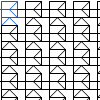][3x3_5] | [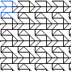][3x3_140] | [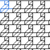][3x3_187] | [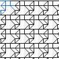][3x3_246] | [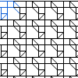][3x3_268]
<a href="tl/3_4_5_7/3x3_5.txt" download="3x3_5.txt">3x3_5</a> | <a href="tl/3_4_5_7/3x3_140.txt" download="3x3_140.txt">3x3_140</a> | <a href="tl/3_4_5_7/3x3_187.txt" download="3x3_187.txt">3x3_187</a> | <a href="tl/3_4_5_7/3x3_246.txt" download="3x3_246.txt">3x3_246</a> | <a href="tl/3_4_5_7/3x3_268.txt" download="3x3_268.txt">3x3_268</a>
[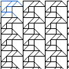][3x4_159] | [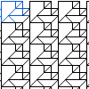][3x4_176] | [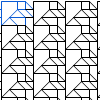][3x4_177] | [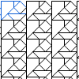][3x4_178] | [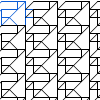][3x4_220]
<a href="tl/3_4_5_7/3x4_159.txt" download="3x4_159.txt">3x4_159</a> | <a href="tl/3_4_5_7/3x4_176.txt" download="3x4_176.txt">3x4_176</a> | <a href="tl/3_4_5_7/3x4_177.txt" download="3x4_177.txt">3x4_177</a> | <a href="tl/3_4_5_7/3x4_178.txt" download="3x4_178.txt">3x4_178</a> | <a href="tl/3_4_5_7/3x4_220.txt" download="3x4_220.txt">3x4_220</a>
[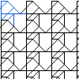][3x4_261] | [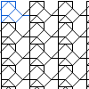][3x4_283] | [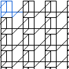][3x4_285] | [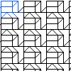][3x4_291] | [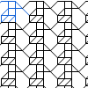][3x4_381]
<a href="tl/3_4_5_7/3x4_261.txt" download="3x4_261.txt">3x4_261</a> | <a href="tl/3_4_5_7/3x4_283.txt" download="3x4_283.txt">3x4_283</a> | <a href="tl/3_4_5_7/3x4_285.txt" download="3x4_285.txt">3x4_285</a> | <a href="tl/3_4_5_7/3x4_291.txt" download="3x4_291.txt">3x4_291</a> | <a href="tl/3_4_5_7/3x4_381.txt" download="3x4_381.txt">3x4_381</a>
[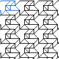][3x4_414] | [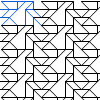][3x5_39] | [][3x5_318] | [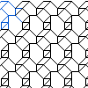][4x3_15] | [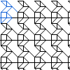][4x3_91]
<a href="tl/3_4_5_7/3x4_414.txt" download="3x4_414.txt">3x4_414</a> | <a href="tl/3_4_5_7/3x5_39.txt" download="3x5_39.txt">3x5_39</a> | <a href="tl/3_4_5_7/3x5_318.txt" download="3x5_318.txt">3x5_318</a> | <a href="tl/3_4_5_7/4x3_15.txt" download="4x3_15.txt">4x3_15</a> | <a href="tl/3_4_5_7/4x3_91.txt" download="4x3_91.txt">4x3_91</a>
[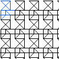][4x3_92] | [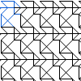][4x3_174] | [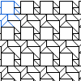][4x3_323] | [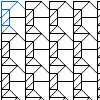][4x3_399] | [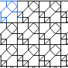][4x4_59]
<a href="tl/3_4_5_7/4x3_92.txt" download="4x3_92.txt">4x3_92</a> | <a href="tl/3_4_5_7/4x3_174.txt" download="4x3_174.txt">4x3_174</a> | <a href="tl/3_4_5_7/4x3_323.txt" download="4x3_323.txt">4x3_323</a> | <a href="tl/3_4_5_7/4x3_399.txt" download="4x3_399.txt">4x3_399</a> | <a href="tl/3_4_5_7/4x4_59.txt" download="4x4_59.txt">4x4_59</a>
[][4x4_64] | [][4x4_67] | [][4x4_110] | [][4x4_111] | [][4x4_142]
<a href="tl/3_4_5_7/4x4_64.txt" download="4x4_64.txt">4x4_64</a> | <a href="tl/3_4_5_7/4x4_67.txt" download="4x4_67.txt">4x4_67</a> | <a href="tl/3_4_5_7/4x4_110.txt" download="4x4_110.txt">4x4_110</a> | <a href="tl/3_4_5_7/4x4_111.txt" download="4x4_111.txt">4x4_111</a> | <a href="tl/3_4_5_7/4x4_142.txt" download="4x4_142.txt">4x4_142</a>

3,4,6 and 7
------------

|     |     |     |     |     |
|:---|:---|:---|:---|:---|
[][3x4_467] | [][3x5_36] | [][3x5_184] | [][3x5_188] | [][3x5_293]
<a href="tl/3_4_6_7/3x4_467.txt" download="3x4_467.txt">3x4_467</a> | <a href="tl/3_4_6_7/3x5_36.txt" download="3x5_36.txt">3x5_36</a> | <a href="tl/3_4_6_7/3x5_184.txt" download="3x5_184.txt">3x5_184</a> | <a href="tl/3_4_6_7/3x5_188.txt" download="3x5_188.txt">3x5_188</a> | <a href="tl/3_4_6_7/3x5_293.txt" download="3x5_293.txt">3x5_293</a>
[][3x5_50] | [][4x3_82] | [][4x3_158] | [][4x3_284] | [][4x3_405]
<a href="tl/3_4_6_7/3x5_50.txt" download="3x5_50.txt">3x5_50</a>| <a href="tl/3_4_6_7/4x3_82.txt" download="4x3_82.txt">4x3_82</a> | <a href="tl/3_4_6_7/4x3_158.txt" download="4x3_158.txt">4x3_158</a> | <a href="tl/3_4_6_7/4x3_284.txt" download="4x3_284.txt">4x3_284</a> | <a href="tl/3_4_6_7/4x3_405.txt" download="4x3_405.txt">4x3_405</a>
[][4x4_53] | [][4x4_72] | [][4x4_73] | [][4x4_101] | [][4x4_195]
<a href="tl/3_4_6_7/4x4_53.txt" download="4x4_53.txt">4x4_53</a> | <a href="tl/3_4_6_7/4x4_72.txt" download="4x4_72.txt">4x4_72</a> | <a href="tl/3_4_6_7/4x4_73.txt" download="4x4_73.txt">4x4_73</a> | <a href="tl/3_4_6_7/4x4_101.txt" download="4x4_101.txt">4x4_101</a> | <a href="tl/3_4_6_7/4x4_195.txt" download="4x4_195.txt">4x4_195</a>

3,4,5,6, and 7
---------------

|     |     |     |     |     |
|:---|:---|:---|:---|:---|
[][3x5_240] | [][3x5_249] | [][3x5_397] | [][3x5_443] | [][3x5_444]
<a href="tl/3_4_5_6_7/3x5_240.txt" download="3x5_240.txt">3x5_240</a> | <a href="tl/3_4_5_6_7/3x5_249.txt" download="3x5_249.txt">3x5_249</a> | <a href="tl/3_4_5_6_7/3x5_397.txt" download="3x5_397.txt">3x5_397</a> | <a href="tl/3_4_5_6_7/3x5_443.txt" download="3x5_443.txt">3x5_443</a> | <a href="tl/3_4_5_6_7/3x5_444.txt" download="3x5_444.txt">3x5_444</a>
[][3x5_94] | [][4x3_490] | [][4x4_52] | [][4x4_70] | [][4x4_100]
<a href="tl/3_4_5_6_7/3x5_94.txt" download="3x5_94.txt">3x5_94</a> | <a href="tl/3_4_5_6_7/4x3_490.txt" download="4x3_490.txt">4x3_490</a> | <a href="tl/3_4_5_6_7/4x4_52.txt" download="4x4_52.txt">4x4_52</a> | <a href="tl/3_4_5_6_7/4x4_70.txt" download="4x4_70.txt">4x4_70</a> | <a href="tl/3_4_5_6_7/4x4_100.txt" download="4x4_100.txt">4x4_100</a>
[][4x4_156] |
<a href="tl/3_4_5_6_7/4x4_156.txt" download="4x4_156.txt">4x4_156</a> |

[4x3_264]: /GroundForge/tiles.html?patchWidth=12&patchHeight=12&tile=4-O,25-,-7E,56-&shiftColsSW=0&shiftRowsSW=4&shiftColsSE=3&shiftRowsSE=0&
[4x3_289]: /GroundForge/tiles.html?patchWidth=12&patchHeight=12&tile=4-L,O5-,-25,04-&shiftColsSW=0&shiftRowsSW=4&shiftColsSE=3&shiftRowsSE=0&

[3x3_59]: /GroundForge/tiles.html?patchWidth=12&patchHeight=12&tile=B-O,221,-4-&shiftColsSW=0&shiftRowsSW=3&shiftColsSE=3&shiftRowsSE=0&
[3x3_86]: /GroundForge/tiles.html?patchWidth=12&patchHeight=12&tile=46-,4--,8D6&shiftColsSW=0&shiftRowsSW=3&shiftColsSE=3&shiftRowsSE=0&
[3x4_206]: /GroundForge/tiles.html?patchWidth=12&patchHeight=12&tile=46--,68-B,6866&shiftColsSW=0&shiftRowsSW=3&shiftColsSE=4&shiftRowsSE=0&
[3x4_262]: /GroundForge/tiles.html?patchWidth=12&patchHeight=12&tile=466-,14--,88D6&shiftColsSW=0&shiftRowsSW=3&shiftColsSE=4&shiftRowsSE=0&
[3x4_280]: /GroundForge/tiles.html?patchWidth=12&patchHeight=12&tile=4-M-,F-1C,8666&shiftColsSW=0&shiftRowsSW=3&shiftColsSE=4&shiftRowsSE=0&
[3x4_295]: /GroundForge/tiles.html?patchWidth=12&patchHeight=12&tile=4-M-,1E-C,8866&shiftColsSW=0&shiftRowsSW=3&shiftColsSE=4&shiftRowsSE=0&
[3x4_459]: /GroundForge/tiles.html?patchWidth=12&patchHeight=12&tile=4-O9,-50F,6317&shiftColsSW=0&shiftRowsSW=3&shiftColsSE=4&shiftRowsSE=0&
[3x4_464]: /GroundForge/tiles.html?patchWidth=12&patchHeight=12&tile=B-O9,2211,-14-&shiftColsSW=0&shiftRowsSW=3&shiftColsSE=4&shiftRowsSE=0&
[3x4_473]: /GroundForge/tiles.html?patchWidth=12&patchHeight=12&tile=B-M9,2211,-46-&shiftColsSW=0&shiftRowsSW=3&shiftColsSE=4&shiftRowsSE=0&
[3x5_231]: /GroundForge/tiles.html?patchWidth=12&patchHeight=12&tile=5-O37,-E-17,B8-43&shiftColsSW=0&shiftRowsSW=3&shiftColsSE=5&shiftRowsSE=0&
[3x5_232]: /GroundForge/tiles.html?patchWidth=12&patchHeight=12&tile=5-O89,-E-48,B8-01&shiftColsSW=0&shiftRowsSW=3&shiftColsSE=5&shiftRowsSE=0&
[3x5_262]: /GroundForge/tiles.html?patchWidth=12&patchHeight=12&tile=5-O37,-004-,B8-73&shiftColsSW=0&shiftRowsSW=3&shiftColsSE=5&shiftRowsSE=0&
[4x4_159]: /GroundForge/tiles.html?patchWidth=12&patchHeight=12&tile=5831,-4-7,6-58,-5-4&shiftColsSW=0&shiftRowsSW=4&shiftColsSE=4&shiftRowsSE=0&
[4x4_201]: /GroundForge/tiles.html?patchWidth=12&patchHeight=12&tile=588-,-789,5-11,-014&shiftColsSW=0&shiftRowsSW=4&shiftColsSE=4&shiftRowsSE=0&
[4x4_57]: /GroundForge/tiles.html?patchWidth=12&patchHeight=12&tile=4831,-488,214-,88-5&shiftColsSW=0&shiftRowsSW=4&shiftColsSE=4&shiftRowsSE=0&
[4x4_58]: /GroundForge/tiles.html?patchWidth=12&patchHeight=12&tile=4831,-488,2111,88-7&shiftColsSW=0&shiftRowsSW=4&shiftColsSE=4&shiftRowsSE=0&
[4x4_63]: /GroundForge/tiles.html?patchWidth=12&patchHeight=12&tile=4831,-4-7,215-,88-5&shiftColsSW=0&shiftRowsSW=4&shiftColsSE=4&shiftRowsSE=0&

[3x3_56]: /GroundForge/tiles.html?patchWidth=12&patchHeight=12&tile=4-L,-5-,31C&shiftColsSW=0&shiftRowsSW=3&shiftColsSE=3&shiftRowsSE=0&
[3x3_65]: /GroundForge/tiles.html?patchWidth=12&patchHeight=12&tile=4-O,7E-,48-&shiftColsSW=0&shiftRowsSW=3&shiftColsSE=3&shiftRowsSE=0&
[3x3_72]: /GroundForge/tiles.html?patchWidth=12&patchHeight=12&tile=4-L,25-,17-&shiftColsSW=0&shiftRowsSW=3&shiftColsSE=3&shiftRowsSE=0&
[3x3_93]: /GroundForge/tiles.html?patchWidth=12&patchHeight=12&tile=4-O,-5F,56-&shiftColsSW=0&shiftRowsSW=3&shiftColsSE=3&shiftRowsSE=0&
[3x3_134]: /GroundForge/tiles.html?patchWidth=12&patchHeight=12&tile=5-O,7-1,-04&shiftColsSW=0&shiftRowsSW=3&shiftColsSE=3&shiftRowsSE=0&
[4x3_220]: /GroundForge/tiles.html?patchWidth=12&patchHeight=12&tile=B8-,--5,2B-,-7-&shiftColsSW=0&shiftRowsSW=4&shiftColsSE=3&shiftRowsSE=0&
[4x3_413]: /GroundForge/tiles.html?patchWidth=12&patchHeight=12&tile=B-O,7--,F-B,-5-&shiftColsSW=0&shiftRowsSW=4&shiftColsSE=3&shiftRowsSE=0&
[4x4_157]: /GroundForge/tiles.html?patchWidth=12&patchHeight=12&tile=5831,-4-7,6868,-4-4&shiftColsSW=0&shiftRowsSW=4&shiftColsSE=4&shiftRowsSE=0&

[3x3_140]: /GroundForge/tiles.html?patchWidth=12&patchHeight=12&tile=4-O,221,634&shiftColsSW=0&shiftRowsSW=3&shiftColsSE=3&shiftRowsSE=0&
[3x3_187]: /GroundForge/tiles.html?patchWidth=12&patchHeight=12&tile=463,-48,668&shiftColsSW=0&shiftRowsSW=3&shiftColsSE=3&shiftRowsSE=0&
[3x3_246]: /GroundForge/tiles.html?patchWidth=12&patchHeight=12&tile=430,688,27-&shiftColsSW=0&shiftRowsSW=3&shiftColsSE=3&shiftRowsSE=0&
[3x3_268]: /GroundForge/tiles.html?patchWidth=12&patchHeight=12&tile=483,211,78-&shiftColsSW=0&shiftRowsSW=3&shiftColsSE=3&shiftRowsSE=0&
[3x3_5]: /GroundForge/tiles.html?patchWidth=12&patchHeight=12&tile=4-O,101,837&shiftColsSW=0&shiftRowsSW=3&shiftColsSE=3&shiftRowsSE=0&
[3x4_159]: /GroundForge/tiles.html?patchWidth=12&patchHeight=12&tile=4-M9,70E-,488-&shiftColsSW=0&shiftRowsSW=3&shiftColsSE=4&shiftRowsSE=0&
[3x4_176]: /GroundForge/tiles.html?patchWidth=12&patchHeight=12&tile=4-O6,8-48,8E-4&shiftColsSW=0&shiftRowsSW=3&shiftColsSE=4&shiftRowsSE=0&
[3x4_177]: /GroundForge/tiles.html?patchWidth=12&patchHeight=12&tile=4-O8,7-11,7E-2&shiftColsSW=0&shiftRowsSW=3&shiftColsSE=4&shiftRowsSE=0&
[3x4_178]: /GroundForge/tiles.html?patchWidth=12&patchHeight=12&tile=4-O6,7-4-,8E-5&shiftColsSW=0&shiftRowsSW=3&shiftColsSE=4&shiftRowsSE=0&
[3x4_220]: /GroundForge/tiles.html?patchWidth=12&patchHeight=12&tile=4-O8,I-44,86-4&shiftColsSW=0&shiftRowsSW=3&shiftColsSE=4&shiftRowsSE=0&
[3x4_261]: /GroundForge/tiles.html?patchWidth=12&patchHeight=12&tile=46--,4-C-,8635&shiftColsSW=0&shiftRowsSW=3&shiftColsSE=4&shiftRowsSE=0&
[3x4_283]: /GroundForge/tiles.html?patchWidth=12&patchHeight=12&tile=435-,4-7-,86-5&shiftColsSW=0&shiftRowsSW=3&shiftColsSE=4&shiftRowsSE=0&
[3x4_285]: /GroundForge/tiles.html?patchWidth=12&patchHeight=12&tile=434-,4---,8DD6&shiftColsSW=0&shiftRowsSW=3&shiftColsSE=4&shiftRowsSE=0&
[3x4_291]: /GroundForge/tiles.html?patchWidth=12&patchHeight=12&tile=4-O9,F-4-,831B&shiftColsSW=0&shiftRowsSW=3&shiftColsSE=4&shiftRowsSE=0&
[3x4_381]: /GroundForge/tiles.html?patchWidth=12&patchHeight=12&tile=468-,-115,588-&shiftColsSW=0&shiftRowsSW=3&shiftColsSE=4&shiftRowsSE=0&
[3x4_414]: /GroundForge/tiles.html?patchWidth=12&patchHeight=12&tile=4-O6,-004,O17-&shiftColsSW=0&shiftRowsSW=3&shiftColsSE=4&shiftRowsSE=0&
[3x5_318]: /GroundForge/tiles.html?patchWidth=12&patchHeight=12&tile=434--,4-7-A,86868&shiftColsSW=0&shiftRowsSW=3&shiftColsSE=5&shiftRowsSE=0&
[3x5_39]: /GroundForge/tiles.html?patchWidth=12&patchHeight=12&tile=5-OD8,-240F,56--2&shiftColsSW=0&shiftRowsSW=3&shiftColsSE=5&shiftRowsSE=0&
[4x3_15]: /GroundForge/tiles.html?patchWidth=12&patchHeight=12&tile=48-,6-5,-24,58-&shiftColsSW=0&shiftRowsSW=4&shiftColsSE=3&shiftRowsSE=0&
[4x3_174]: /GroundForge/tiles.html?patchWidth=12&patchHeight=12&tile=B-O,221,6-4,-5-&shiftColsSW=0&shiftRowsSW=4&shiftColsSE=3&shiftRowsSE=0&
[4x3_323]: /GroundForge/tiles.html?patchWidth=12&patchHeight=12&tile=4-O,7-1,731,5F-&shiftColsSW=0&shiftRowsSW=4&shiftColsSE=3&shiftRowsSE=0&
[4x3_399]: /GroundForge/tiles.html?patchWidth=12&patchHeight=12&tile=4-O,76-,4F-,48-&shiftColsSW=0&shiftRowsSW=4&shiftColsSE=3&shiftRowsSE=0&
[4x3_91]: /GroundForge/tiles.html?patchWidth=12&patchHeight=12&tile=46-,-79,56-,112&shiftColsSW=0&shiftRowsSW=4&shiftColsSE=3&shiftRowsSE=0&
[4x3_92]: /GroundForge/tiles.html?patchWidth=12&patchHeight=12&tile=4-M,-5-,63C,112&shiftColsSW=0&shiftRowsSW=4&shiftColsSE=3&shiftRowsSE=0&
[4x4_110]: /GroundForge/tiles.html?patchWidth=12&patchHeight=12&tile=B8D-,-115,588-,-4--&shiftColsSW=0&shiftRowsSW=4&shiftColsSE=4&shiftRowsSE=0&
[4x4_111]: /GroundForge/tiles.html?patchWidth=12&patchHeight=12&tile=B8D-,-115,5-7-,-5--&shiftColsSW=0&shiftRowsSW=4&shiftColsSE=4&shiftRowsSE=0&
[4x4_142]: /GroundForge/tiles.html?patchWidth=12&patchHeight=12&tile=586-,-4-5,5---,-C-B&shiftColsSW=0&shiftRowsSW=4&shiftColsSE=4&shiftRowsSE=0&
[4x4_59]: /GroundForge/tiles.html?patchWidth=12&patchHeight=12&tile=4831,-4-7,6-58,86-4&shiftColsSW=0&shiftRowsSW=4&shiftColsSE=4&shiftRowsSE=0&
[4x4_64]: /GroundForge/tiles.html?patchWidth=12&patchHeight=12&tile=4831,-4-7,2121,88-7&shiftColsSW=0&shiftRowsSW=4&shiftColsSE=4&shiftRowsSE=0&
[4x4_67]: /GroundForge/tiles.html?patchWidth=12&patchHeight=12&tile=4831,-117,6-78,86-4&shiftColsSW=0&shiftRowsSW=4&shiftColsSE=4&shiftRowsSE=0&

[3x4_467]: /GroundForge/tiles.html?patchWidth=12&patchHeight=12&tile=4-M9,-50F,6637&shiftColsSW=0&shiftRowsSW=3&shiftColsSE=4&shiftRowsSE=0&
[3x5_184]: /GroundForge/tiles.html?patchWidth=12&patchHeight=12&tile=5-M99,-E-48,B8301&shiftColsSW=0&shiftRowsSW=3&shiftColsSE=5&shiftRowsSE=0&
[3x5_188]: /GroundForge/tiles.html?patchWidth=12&patchHeight=12&tile=5-O37,-004-,B3783&shiftColsSW=0&shiftRowsSW=3&shiftColsSE=5&shiftRowsSE=0&
[3x5_293]: /GroundForge/tiles.html?patchWidth=12&patchHeight=12&tile=5-O37,-E-17,B3563&shiftColsSW=0&shiftRowsSW=3&shiftColsSE=5&shiftRowsSE=0&
[3x5_36]: /GroundForge/tiles.html?patchWidth=12&patchHeight=12&tile=5-M99,-240F,56312&shiftColsSW=0&shiftRowsSW=3&shiftColsSE=5&shiftRowsSE=0&
[3x5_50]: /GroundForge/tiles.html?patchWidth=12&patchHeight=12&tile=5-M9-,-501G,568-2&shiftColsSW=0&shiftRowsSW=3&shiftColsSE=5&shiftRowsSE=0&
[4x3_158]: /GroundForge/tiles.html?patchWidth=12&patchHeight=12&tile=4-O,-04,688,46-&shiftColsSW=0&shiftRowsSW=4&shiftColsSE=3&shiftRowsSE=0&
[4x3_284]: /GroundForge/tiles.html?patchWidth=12&patchHeight=12&tile=4-L,O5-,122,14-&shiftColsSW=0&shiftRowsSW=4&shiftColsSE=3&shiftRowsSE=0&
[4x3_405]: /GroundForge/tiles.html?patchWidth=12&patchHeight=12&tile=4-O,868,4-1,7E-&shiftColsSW=0&shiftRowsSW=4&shiftColsSE=3&shiftRowsSE=0&
[4x3_82]: /GroundForge/tiles.html?patchWidth=12&patchHeight=12&tile=4-O,868,-7F,5E-&shiftColsSW=0&shiftRowsSW=4&shiftColsSE=3&shiftRowsSE=0&
[4x4_101]: /GroundForge/tiles.html?patchWidth=12&patchHeight=12&tile=B83A,-4-7,6-58,-5--&shiftColsSW=0&shiftRowsSW=4&shiftColsSE=4&shiftRowsSE=0&
[4x4_195]: /GroundForge/tiles.html?patchWidth=12&patchHeight=12&tile=588-,8889,4-11,-014&shiftColsSW=0&shiftRowsSW=4&shiftColsSE=4&shiftRowsSE=0&
[4x4_53]: /GroundForge/tiles.html?patchWidth=12&patchHeight=12&tile=4831,-488,6-48,86-4&shiftColsSW=0&shiftRowsSW=4&shiftColsSE=4&shiftRowsSE=0&
[4x4_72]: /GroundForge/tiles.html?patchWidth=12&patchHeight=12&tile=4831,---7,2AB-,88-5&shiftColsSW=0&shiftRowsSW=4&shiftColsSE=4&shiftRowsSE=0&
[4x4_73]: /GroundForge/tiles.html?patchWidth=12&patchHeight=12&tile=4831,---7,2AA1,88-7&shiftColsSW=0&shiftRowsSW=4&shiftColsSE=4&shiftRowsSE=0&

[3x5_240]: /GroundForge/tiles.html?patchWidth=12&patchHeight=12&tile=437--,4-7-A,83158&shiftColsSW=0&shiftRowsSW=3&shiftColsSE=5&shiftRowsSE=0&
[3x5_249]: /GroundForge/tiles.html?patchWidth=12&patchHeight=12&tile=437--,4-73A,834-7&shiftColsSW=0&shiftRowsSW=3&shiftColsSE=5&shiftRowsSE=0&
[3x5_397]: /GroundForge/tiles.html?patchWidth=12&patchHeight=12&tile=4-J04,7--7-,12B-O&shiftColsSW=0&shiftRowsSW=3&shiftColsSE=5&shiftRowsSE=0&
[3x5_443]: /GroundForge/tiles.html?patchWidth=12&patchHeight=12&tile=7-M37,--437,G-443&shiftColsSW=0&shiftRowsSW=3&shiftColsSE=5&shiftRowsSE=0&
[3x5_444]: /GroundForge/tiles.html?patchWidth=12&patchHeight=12&tile=7-M89,--468,G-401&shiftColsSW=0&shiftRowsSW=3&shiftColsSE=5&shiftRowsSE=0&
[3x5_94]: /GroundForge/tiles.html?patchWidth=12&patchHeight=12&tile=5-M99,-240F,-4317&shiftColsSW=0&shiftRowsSW=3&shiftColsSE=5&shiftRowsSE=0&
[4x3_490]: /GroundForge/tiles.html?patchWidth=12&patchHeight=12&tile=7-M,7-1,304,173&shiftColsSW=0&shiftRowsSW=4&shiftColsSE=3&shiftRowsSE=0&
[4x4_100]: /GroundForge/tiles.html?patchWidth=12&patchHeight=12&tile=B83A,-4-7,6868,-4--&shiftColsSW=0&shiftRowsSW=4&shiftColsSE=4&shiftRowsSE=0&
[4x4_156]: /GroundForge/tiles.html?patchWidth=12&patchHeight=12&tile=586-,-789,2111,-4-4&shiftColsSW=0&shiftRowsSW=4&shiftColsSE=4&shiftRowsSE=0&
[4x4_52]: /GroundForge/tiles.html?patchWidth=12&patchHeight=12&tile=486-,-4--,A1C-,88-5&shiftColsSW=0&shiftRowsSW=4&shiftColsSE=4&shiftRowsSE=0&
[4x4_70]: /GroundForge/tiles.html?patchWidth=12&patchHeight=12&tile=4831,-4--,6-CD,86-4&shiftColsSW=0&shiftRowsSW=4&shiftColsSE=4&shiftRowsSE=0&

