[TesseLace.com]: https://tesselace.com
[GroundForge]: /GroundForge/tiles.html

Octagon, nonagon and decagon holes
===================================

In the following tables, 
* click on the **image** to see thread and pair diagrams in [GroundForge],
* click on the **name** to download a template file for use with the [Bobbin Lace plugins for Inkscape](https://tesselace.com/tools/inkscape-extension/).

Families of patterns are variations of the same pattern with [modified pin positions](/GroundForge/help/Reshape-Patterns).  Note: Currently, GroundForge does not support pin positions therefore the thread diagrams for all members of a family look the same.

<a name="8">Octagons</a>
--------

|     |     |     |     |     |
|:---|:---|:---|:---|:---|
[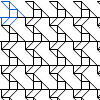][3x3_50] | [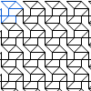][3x3_62] | [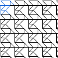][3x3_79] | [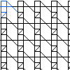][3x3_120] | [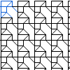][3x3_124]
<a href="tl/3_4_8/3x3_50.txt" download="3x3_50.txt">3x3_50</a> | <a href="tl/3_4_8/3x3_62.txt" download="3x3_62.txt">3x3_62</a> | <a href="tl/3_4_8/3x3_79.txt" download="3x3_79.txt">3x3_79</a> | <a href="tl/3_4_8/3x3_120.txt" download="3x3_120.txt">3x3_120</a> | <a href="tl/3_4_8/3x3_124.txt" download="3x3_124.txt">3x3_124</a>
[][3x3_143] | [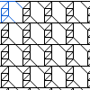][3x3_209] | [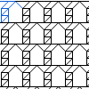][3x3_225] | [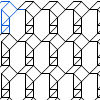][4x3_102] | [][4x3_193]
<a href="tl/3_4_8/3x3_143.txt" download="3x3_143.txt">3x3_143</a> | <a href="tl/3_4_8/3x3_209.txt" download="3x3_209.txt">3x3_209</a> | <a href="tl/3_4_8/3x3_225.txt" download="3x3_225.txt">3x3_225</a> | <a href="tl/3_4_8/4x3_102.txt" download="4x3_102.txt">4x3_102</a> | <a href="tl/3_4_8/4x3_193.txt" download="4x3_193.txt">4x3_193</a>
[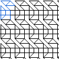][4x3_282] | [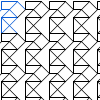][4x3_392] | [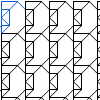][4x3_487] | [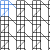][4x4_115] | [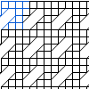][4x4_185]
<a href="tl/3_4_8/4x3_282.txt" download="4x3_282.txt">4x3_282</a> | <a href="tl/3_4_8/4x3_392.txt" download="4x3_392.txt">4x3_392</a> | <a href="tl/3_4_8/4x3_487.txt" download="4x3_487.txt">4x3_487</a> | <a href="tl/3_4_8/4x4_115.txt" download="4x4_115.txt">4x4_115</a> | <a href="tl/3_4_8/4x4_185.txt" download="4x4_185.txt">4x4_185</a>
[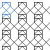][4x4_117415] | [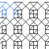][4x4_59939] | [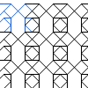][4x4_59948] 
<a href="tl/3_4_8/4x4_117415.txt" download="4x4_117415.txt">4x4_117415</a> | <a href="tl/3_4_8/4x4_59939.txt" download="4x4_59939.txt">4x4_59939</a> | <a href="tl/3_4_8/4x4_59948.txt" download="4x4_59948.txt">4x4_59948</a>
[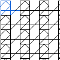][3x4_287] | [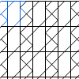][4x4_126]
<a href="tl/3_5_8/3x4_287.txt" download="3x4_287.txt">3x4_287</a> | <a href="tl/3_5_8/4x4_126.txt" download="4x4_126.txt">4x4_126</a>
[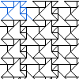][3x5_87] | [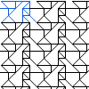][3x5_93]
<a href="tl/3_4_5_6_8/3x5_87.txt" download="3x5_87.txt">3x5_87</a> | <a href="tl/3_4_5_6_8/3x5_93.txt" download="3x5_93.txt">3x5_93</a>
[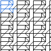][3x4_281] | [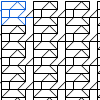][3x4_294] | [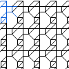][4x3_10] | [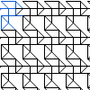][4x3_166] | [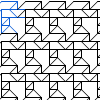][4x3_204]
<a href="tl/3_4_5_8/3x4_281.txt" download="3x4_281.txt">3x4_281</a> | <a href="tl/3_4_5_8/3x4_294.txt" download="3x4_294.txt">3x4_294</a> | <a href="tl/3_4_5_8/4x3_10.txt" download="4x3_10.txt">4x3_10</a> | <a href="tl/3_4_5_8/4x3_166.txt" download="4x3_166.txt">4x3_166</a> | <a href="tl/3_4_5_8/4x3_204.txt" download="4x3_204.txt">4x3_204</a>
[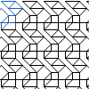][4x3_285] | [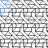][4x3_286] | [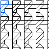][4x3_396] | [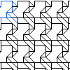][4x3_441] | [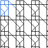][4x4_116]
<a href="tl/3_4_5_8/4x3_285.txt" download="4x3_285.txt">4x3_285</a> | <a href="tl/3_4_5_8/4x3_286.txt" download="4x3_286.txt">4x3_286</a> | <a href="tl/3_4_5_8/4x3_396.txt" download="4x3_396.txt">4x3_396</a> | <a href="tl/3_4_5_8/4x3_441.txt" download="4x3_441.txt">4x3_441</a> | <a href="tl/3_4_5_8/4x4_116.txt" download="4x4_116.txt">4x4_116</a>
[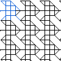][4x4_202] |
<a href="tl/3_4_5_8/4x4_202.txt" download="4x4_202.txt">4x4_202</a> |
[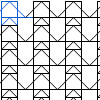][3x4_279] | [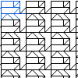][3x4_293] | [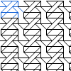][3x4_447] | [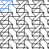][3x4_449] | [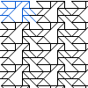][3x5_41]
<a href="tl/3_4_6_8/3x4_279.txt" download="3x4_279.txt">3x4_279</a> | <a href="tl/3_4_6_8/3x4_293.txt" download="3x4_293.txt">3x4_293</a> | <a href="tl/3_4_6_8/3x4_447.txt" download="3x4_447.txt">3x4_447</a> | <a href="tl/3_4_6_8/3x4_449.txt" download="3x4_449.txt">3x4_449</a> | <a href="tl/3_4_6_8/3x5_41.txt" download="3x5_41.txt">3x5_41</a>
[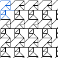][4x3_155] | [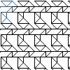][4x3_164] | [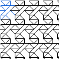][4x3_262] | [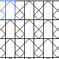][4x4_163] | [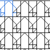][4x4_65]
<a href="tl/3_4_6_8/4x3_155.txt" download="4x3_155.txt">4x3_155</a> | <a href="tl/3_4_6_8/4x3_164.txt" download="4x3_164.txt">4x3_164</a> | <a href="tl/3_4_6_8/4x3_262.txt" download="4x3_262.txt">4x3_262</a> | <a href="tl/3_4_6_8/4x4_163.txt" download="4x4_163.txt">4x4_163</a> | <a href="tl/3_4_6_8/4x4_65.txt" download="4x4_65.txt">4x4_65</a>

<a name="9">Nonagons</a>
--------

|     |     |     |     |     |
|:---|:---|:---|:---|:---|
[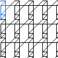][4x3_98] | [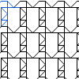][4x3_115] | [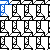][4x3_136] | [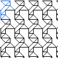][4x3_231] | [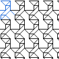][4x3_373]
<a href="tl/3_4_9/4x3_98.txt" download="4x3_98.txt">4x3_98</a> | <a href="tl/3_5_9/4x3_115.txt" download="4x3_115.txt">4x3_115</a> | <a href="tl/3_5_9/4x3_136.txt" download="4x3_136.txt">4x3_136</a> | <a href="tl/3_5_9/4x3_231.txt" download="4x3_231.txt">4x3_231</a> | <a href="tl/3_5_9/4x3_373.txt" download="4x3_373.txt">4x3_373</a>
[][4x3_393] | [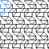][4x3_288] | [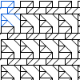][4x3_466]
<a href="tl/3_5_9/4x3_393.txt" download="4x3_393.txt">4x3_393</a> | <a href="tl/3_4_5_9/4x3_288.txt" download="4x3_288.txt">4x3_288</a> | <a href="tl/3_4_5_9/4x3_466.txt" download="4x3_466.txt">4x3_466</a>

<a name="10">Decagons</a>
--------

|     |     |     |     |     |
|:---|:---|:---|:---|:---|
[][4x3_368] | [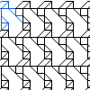][4x3_86]
<a href="tl/3_4_10/4x3_368.txt" download="4x3_368.txt">4x3_368</a> | <a href="tl/3_4_10/4x3_86.txt" download="4x3_86.txt">4x3_86</a>

[3x3_120]: /GroundForge/tiles.html?patchWidth=12&patchHeight=12&tile=48-,112,78-&shiftColsSW=0&shiftRowsSW=3&shiftColsSE=3&shiftRowsSE=0&
[3x3_124]: /GroundForge/tiles.html?patchWidth=12&patchHeight=12&tile=4-O,101,78-&shiftColsSW=0&shiftRowsSW=3&shiftColsSE=3&shiftRowsSE=0&
[3x3_143]: /GroundForge/tiles.html?patchWidth=12&patchHeight=12&tile=48-,686,46-&shiftColsSW=0&shiftRowsSW=3&shiftColsSE=3&shiftRowsSE=0&
[3x3_209]: /GroundForge/tiles.html?patchWidth=12&patchHeight=12&tile=432,58-,48-&shiftColsSW=0&shiftRowsSW=3&shiftColsSE=3&shiftRowsSE=0&
[3x3_225]: /GroundForge/tiles.html?patchWidth=12&patchHeight=12&tile=483,56-,48-&shiftColsSW=0&shiftRowsSW=3&shiftColsSE=3&shiftRowsSE=0&
[3x3_50]: /GroundForge/tiles.html?patchWidth=12&patchHeight=12&tile=46-,-79,211&shiftColsSW=0&shiftRowsSW=3&shiftColsSE=3&shiftRowsSE=0&
[3x3_62]: /GroundForge/tiles.html?patchWidth=12&patchHeight=12&tile=4-M,O5-,110&shiftColsSW=0&shiftRowsSW=3&shiftColsSE=3&shiftRowsSE=0&
[3x3_79]: /GroundForge/tiles.html?patchWidth=12&patchHeight=12&tile=4-O,221,46-&shiftColsSW=0&shiftRowsSW=3&shiftColsSE=3&shiftRowsSE=0&
[4x3_193]: /GroundForge/tiles.html?patchWidth=12&patchHeight=12&tile=48-,686,666,46-&shiftColsSW=0&shiftRowsSW=4&shiftColsSE=3&shiftRowsSE=0&
[4x3_282]: /GroundForge/tiles.html?patchWidth=12&patchHeight=12&tile=4-M,O5-,122,111&shiftColsSW=0&shiftRowsSW=4&shiftColsSE=3&shiftRowsSE=0&
[4x3_392]: /GroundForge/tiles.html?patchWidth=12&patchHeight=12&tile=B-O,76-,E-5,-5-&shiftColsSW=0&shiftRowsSW=4&shiftColsSE=3&shiftRowsSE=0&
[4x3_487]: /GroundForge/tiles.html?patchWidth=12&patchHeight=12&tile=4-L,76-,4--,1C-&shiftColsSW=0&shiftRowsSW=4&shiftColsSE=3&shiftRowsSE=0&
[4x4_115]: /GroundForge/tiles.html?patchWidth=12&patchHeight=12&tile=B8D-,1112,788-,-4--&shiftColsSW=0&shiftRowsSW=4&shiftColsSE=4&shiftRowsSE=0&
[4x4_185]: /GroundForge/tiles.html?patchWidth=12&patchHeight=12&tile=6888,8888,4-11,-014&shiftColsSW=0&shiftRowsSW=4&shiftColsSE=4&shiftRowsSE=0&
[4x4_117415]: /GroundForge/tiles.html?patchWidth=12&patchHeight=12&tile=437-,4-7-,-5-5,535-&shiftColsSW=0&shiftRowsSW=4&shiftColsSE=4&shiftRowsSE=0&
[4x4_59939]: /GroundForge/tiles.html?patchWidth=12&patchHeight=12&tile=48-1,5-5-,35-5,88-4&shiftColsSW=0&shiftRowsSW=4&shiftColsSE=4&shiftRowsSE=0&
[4x4_59948]: /GroundForge/tiles.html?patchWidth=12&patchHeight=12&tile=58-1,5-5-,35-5,-7-4&shiftColsSW=0&shiftRowsSW=4&shiftColsSE=4&shiftRowsSE=0&

[3x4_287]: /GroundForge/tiles.html?patchWidth=12&patchHeight=12&tile=434-,4-7-,8686&shiftColsSW=0&shiftRowsSW=3&shiftColsSE=4&shiftRowsSE=0&
[4x4_126]: /GroundForge/tiles.html?patchWidth=12&patchHeight=12&tile=6868,-4-4,5---,-C-B&shiftColsSW=0&shiftRowsSW=4&shiftColsSE=4&shiftRowsSE=0&

[3x5_87]: /GroundForge/tiles.html?patchWidth=12&patchHeight=12&tile=5-O37,-244I,-4-48&shiftColsSW=0&shiftRowsSW=3&shiftColsSE=5&shiftRowsSE=0&
[3x5_93]: /GroundForge/tiles.html?patchWidth=12&patchHeight=12&tile=5-O89,-240F,-4-17&shiftColsSW=0&shiftRowsSW=3&shiftColsSE=5&shiftRowsSE=0&

[3x4_281]: /GroundForge/tiles.html?patchWidth=12&patchHeight=12&tile=4-J7,F-17,8666&shiftColsSW=0&shiftRowsSW=3&shiftColsSE=4&shiftRowsSE=0&
[3x4_294]: /GroundForge/tiles.html?patchWidth=12&patchHeight=12&tile=4-J7,1E-7,8866&shiftColsSW=0&shiftRowsSW=3&shiftColsSE=4&shiftRowsSE=0&
[4x3_10]: /GroundForge/tiles.html?patchWidth=12&patchHeight=12&tile=48-,686,-14,58-&shiftColsSW=0&shiftRowsSW=4&shiftColsSE=3&shiftRowsSE=0&
[4x3_166]: /GroundForge/tiles.html?patchWidth=12&patchHeight=12&tile=B-O,221,314,-7-&shiftColsSW=0&shiftRowsSW=4&shiftColsSE=3&shiftRowsSE=0&
[4x3_204]: /GroundForge/tiles.html?patchWidth=12&patchHeight=12&tile=4-O,304,835,48-&shiftColsSW=0&shiftRowsSW=4&shiftColsSE=3&shiftRowsSE=0&
[4x3_285]: /GroundForge/tiles.html?patchWidth=12&patchHeight=12&tile=4-M,O5-,-25,011&shiftColsSW=0&shiftRowsSW=4&shiftColsSE=3&shiftRowsSE=0&
[4x3_286]: /GroundForge/tiles.html?patchWidth=12&patchHeight=12&tile=4-M,O5-,325,110&shiftColsSW=0&shiftRowsSW=4&shiftColsSE=3&shiftRowsSE=0&
[4x3_396]: /GroundForge/tiles.html?patchWidth=12&patchHeight=12&tile=4-O,868,4E-,48-&shiftColsSW=0&shiftRowsSW=4&shiftColsSE=3&shiftRowsSE=0&
[4x3_441]: /GroundForge/tiles.html?patchWidth=12&patchHeight=12&tile=7-O,7-1,-04,212&shiftColsSW=0&shiftRowsSW=4&shiftColsSE=3&shiftRowsSE=0&
[4x4_116]: /GroundForge/tiles.html?patchWidth=12&patchHeight=12&tile=B8D-,1112,7-7-,-5--&shiftColsSW=0&shiftRowsSW=4&shiftColsSE=4&shiftRowsSE=0&
[4x4_202]: /GroundForge/tiles.html?patchWidth=12&patchHeight=12&tile=588-,-789,2111,-114&shiftColsSW=0&shiftRowsSW=4&shiftColsSE=4&shiftRowsSE=0&

[4x3_102]: /GroundForge/tiles.html?patchWidth=12&patchHeight=12&tile=48-,6-5,-5-,B8-&shiftColsSW=0&shiftRowsSW=4&shiftColsSE=3&shiftRowsSE=0&

[3x4_279]: /GroundForge/tiles.html?patchWidth=12&patchHeight=12&tile=437-,4-7-,8315&shiftColsSW=0&shiftRowsSW=3&shiftColsSE=4&shiftRowsSE=0&
[3x4_293]: /GroundForge/tiles.html?patchWidth=12&patchHeight=12&tile=4-O9,F-48,8304&shiftColsSW=0&shiftRowsSW=3&shiftColsSE=4&shiftRowsSE=0&
[3x4_447]: /GroundForge/tiles.html?patchWidth=12&patchHeight=12&tile=4-L8,-50F,56-O&shiftColsSW=0&shiftRowsSW=3&shiftColsSE=4&shiftRowsSE=0&
[3x4_449]: /GroundForge/tiles.html?patchWidth=12&patchHeight=12&tile=4-M9,-50F,568-&shiftColsSW=0&shiftRowsSW=3&shiftColsSE=4&shiftRowsSE=0&
[3x5_41]: /GroundForge/tiles.html?patchWidth=12&patchHeight=12&tile=5-O89,-240F,56-12&shiftColsSW=0&shiftRowsSW=3&shiftColsSE=5&shiftRowsSE=0&
[4x3_155]: /GroundForge/tiles.html?patchWidth=12&patchHeight=12&tile=4-O,-04,637,48-&shiftColsSW=0&shiftRowsSW=4&shiftColsSE=3&shiftRowsSE=0&
[4x3_164]: /GroundForge/tiles.html?patchWidth=12&patchHeight=12&tile=B-O,253,304,-7-&shiftColsSW=0&shiftRowsSW=4&shiftColsSE=3&shiftRowsSE=0&
[4x3_262]: /GroundForge/tiles.html?patchWidth=12&patchHeight=12&tile=4-O,358,-5E,56-&shiftColsSW=0&shiftRowsSW=4&shiftColsSE=3&shiftRowsSE=0&
[4x4_163]: /GroundForge/tiles.html?patchWidth=12&patchHeight=12&tile=5831,-4-7,5---,-C-B&shiftColsSW=0&shiftRowsSW=4&shiftColsSE=4&shiftRowsSE=0&
[4x4_65]: /GroundForge/tiles.html?patchWidth=12&patchHeight=12&tile=4831,-4-7,5---,8D-B&shiftColsSW=0&shiftRowsSW=4&shiftColsSE=4&shiftRowsSE=0&

[4x3_98]: /GroundForge/tiles.html?patchWidth=12&patchHeight=12&tile=48-,686,-4-,B8-&shiftColsSW=0&shiftRowsSW=4&shiftColsSE=3&shiftRowsSE=0&
[4x3_115]: /GroundForge/tiles.html?patchWidth=12&patchHeight=12&tile=48-,315,-7-,B8-&shiftColsSW=0&shiftRowsSW=4&shiftColsSE=3&shiftRowsSE=0&
[4x3_136]: /GroundForge/tiles.html?patchWidth=12&patchHeight=12&tile=4-O,304,-7-,B8-&shiftColsSW=0&shiftRowsSW=4&shiftColsSE=3&shiftRowsSE=0&
[4x3_231]: /GroundForge/tiles.html?patchWidth=12&patchHeight=12&tile=4-O,-58,5E-,48-&shiftColsSW=0&shiftRowsSW=4&shiftColsSE=3&shiftRowsSE=0&
[4x3_373]: /GroundForge/tiles.html?patchWidth=12&patchHeight=12&tile=4-O,-58,-4F,56-&shiftColsSW=0&shiftRowsSW=4&shiftColsSE=3&shiftRowsSE=0&
[4x3_393]: /GroundForge/tiles.html?patchWidth=12&patchHeight=12&tile=B-O,731,04-,-7-&shiftColsSW=0&shiftRowsSW=4&shiftColsSE=3&shiftRowsSE=0&
[4x3_288]: /GroundForge/tiles.html?patchWidth=12&patchHeight=12&tile=4-M,O5-,835,010&shiftColsSW=0&shiftRowsSW=4&shiftColsSE=3&shiftRowsSE=0&
[4x3_466]: /GroundForge/tiles.html?patchWidth=12&patchHeight=12&tile=4-O,101,346,79-&shiftColsSW=0&shiftRowsSW=4&shiftColsSE=3&shiftRowsSE=0&

[4x3_368]: /GroundForge/tiles.html?patchWidth=12&patchHeight=12&tile=48-,686,46-,48-&shiftColsSW=0&shiftRowsSW=4&shiftColsSE=3&shiftRowsSE=0&
[4x3_86]: /GroundForge/tiles.html?patchWidth=12&patchHeight=12&tile=48-,010,8-7,79-&shiftColsSW=0&shiftRowsSW=4&shiftColsSE=3&shiftRowsSE=0&
