Burden of Excess 3x4
====================

Pierre Fouch&#233; created a sampler (see "Burden of Excess" [1](http://www.pierrefouche.net/resources/burdenofexcess%20-%201.jpg), [2](http://www.pierrefouche.net/resources/burdenofexcess%20-%202.jpg) and [3](http://www.pierrefouche.net/resources/burdenofexcess%20-%203.jpg)) of grounds that were generated using the [TesseLace algorithm](https://tesselace.com/research/bridges2012/). The basic repeating patten for each of these grounds is 4 columns wide and 3 rows high.  Pierre chose the stitch combinations, realized the lace in 170/2 Egyptian cotton and named the grounds.  Each sample in real life is 2.5 cm wide.  

In the following tables, 
* click on an image to enlarge,
* click on the GroundForge (GF) link to see thread and pair diagrams,
* click on the Inkscape link to download a template file for use with the [Bobbin Lace plugins for Inkscape](https://tesselace.com/tools/inkscape-extension/).

Grounds are grouped according to the number of pairs required.  Grounds in the same group will work on the same grid.  To combine grounds from different groups will require either scaling, or the addition/removal of threads.
 
3 pairs / 4 columns
-------------------

| Sample |  | Sample |  |
:---:|:---|:---:|:---|
[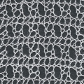](fouche_3x4/large/3x4_344_PFI-bikini-top.jpg)  |  GF:[bikini-top]  Inkscape:<a href="fouche_3x4/thumbnail/3x4_344.txt" download="3x4_344.txt">3x4_344</a> | [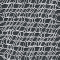](fouche_3x4/large/3x4_345_PFI-rain.jpg)  |  GF:[rain]  Inkscape:<a href="fouche_3x4/thumbnail/3x4_345.txt" download="3x4_345.txt">3x4_345</a> 
[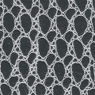](fouche_3x4/large/3x4_400_PFI-trellis.jpg)  |  GF:[trellis]  Inkscape:<a href="fouche_3x4/thumbnail/3x4_400.txt" download="3x4_400.txt">3x4_400</a> | [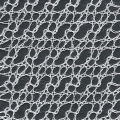](fouche_3x4/large/3x4_451_PFI-trail_and_stripes.jpg)  |  GF:[trail and stripes]  Inkscape:<a href="fouche_3x4/thumbnail/3x4_451.txt" download="3x4_451.txt">3x4_451</a>

 4 pairs / 4 columns
-------------------

| Sample |  | Sample |  |
:---:|:---|:---:|:---|
[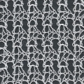](fouche_3x4/large/3x4_162_PFI-coral.jpg)  |  GF:[coral]  Inkscape:<a href="fouche_3x4/thumbnail/3x4_162.txt" download="3x4_162.txt">3x4_162</a> | [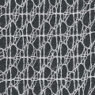](fouche_3x4/large/3x4_191_PFI-dragonfly.jpg)  |  GF:[dragonfly]  Inkscape:<a href="fouche_3x4/thumbnail/3x4_191.txt" download="3x4_191.txt">3x4_191</a>
[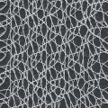](fouche_3x4/large/3x4_330_PFI-swimming-up-the-waterfall.jpg)  |  GF:[swimming up the waterfall]  Inkscape:<a href="fouche_3x4/thumbnail/3x4_330.txt" download="3x4_330.txt">3x4_330</a> | [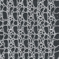](fouche_3x4/large/3x4_360_PFI-cut-diamond.jpg)  |  GF:[cut-diamond]  Inkscape:<a href="fouche_3x4/thumbnail/3x4_360.txt" download="3x4_360.txt">3x4_360</a>
[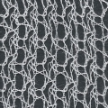](fouche_3x4/large/3x4_369_PFI-updog.jpg)  |  GF:[updog]  Inkscape:<a href="fouche_3x4/thumbnail/3x4_369.txt" download="3x4_369.txt">3x4_369</a> | [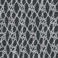](fouche_3x4/large/3x4_420_PFI-flying-squirrel.jpg)  |  GF:[flying squirrel]  Inkscape:<a href="fouche_3x4/thumbnail/3x4_420.txt" download="3x4_420.txt">3x4_420</a>
[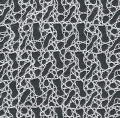](fouche_3x4/large/3x4_467_PFI-mother_and_babe.jpg)  |  GF:[mother &#38; babe]  Inkscape:<a href="fouche_3x4/thumbnail/3x4_467.txt" download="3x4_467.txt">3x4_467</a>

 5 pairs / 4 columns
-------------------

| Sample |  | Sample |  |
:---:|:---|:---:|:---|
[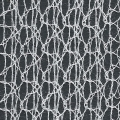](fouche_3x4/large/3x4_128_PFI-clamshell-edge.jpg)  |  GF:[clamshell-edge]  Inkscape:<a href="fouche_3x4/thumbnail/3x4_128.txt" download="3x4_128.txt">3x4_128</a> | [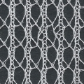](fouche_3x4/large/3x4_203_PFI-Jacob_s-ladder.jpg)  |  GF:[Jacob's ladder]  Inkscape:<a href="fouche_3x4/thumbnail/3x4_203.txt" download="3x4_203.txt">3x4_203</a>
[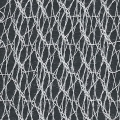](fouche_3x4/large/3x4_245_PFI-sleet.jpg)  |  GF:[sleet]  Inkscape:<a href="fouche_3x4/thumbnail/3x4_245.txt" download="3x4_245.txt">3x4_245</a> | [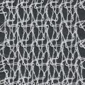](fouche_3x4/large/3x4_267_PFI-greek-waves.jpg)  |  GF:[Greek waves]  Inkscape:<a href="fouche_3x4/thumbnail/3x4_267.txt" download="3x4_267.txt">3x4_267</a>
[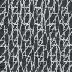](fouche_3x4/large/3x4_286_PFI-deco.jpg)  |  GF:[deco]  Inkscape:<a href="fouche_3x4/thumbnail/3x4_286.txt" download="3x4_286.txt">3x4_286</a> | [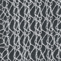](fouche_3x4/large/3x4_411_PFI-archer.jpg)  |  GF:[archer]  Inkscape:<a href="fouche_3x4/thumbnail/3x4_411.txt" download="3x4_411.txt">3x4_411</a>
[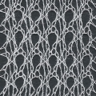](fouche_3x4/large/3x4_415_PFI-nouveau.jpg)  |  GF:[nouveau]  Inkscape:<a href="fouche_3x4/thumbnail/3x4_415.txt" download="3x4_415.txt">3x4_415</a> | [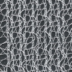](fouche_3x4/large/3x4_436_PFI-mandible.jpg)  |  GF:[mandible]  Inkscape:<a href="fouche_3x4/thumbnail/3x4_436.txt" download="3x4_436.txt">3x4_436</a>

 6 pairs / 4 columns
-------------------

| Sample |  | Sample |  |
:---:|:---|:---:|:---|
[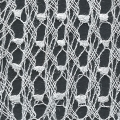](fouche_3x4/large/3x4_34_PFI-mantis.jpg)  |  GF:[mantis]  Inkscape:<a href="fouche_3x4/thumbnail/3x4_34.txt" download="3x4_34.txt">3x4_34</a>  | [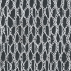](fouche_3x4/large/3x4_89_PFI-wasp-nest.jpg)  |  GF:[wasp nest]  Inkscape:<a href="fouche_3x4/thumbnail/3x4_89.txt" download="3x4_89.txt">3x4_89</a> 
[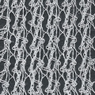](fouche_3x4/large/3x4_251_PFI-bell-pepper.jpg)  |  GF:[bell pepper]  Inkscape:<a href="fouche_3x4/thumbnail/3x4_251.txt" download="3x4_251.txt">3x4_251</a> | [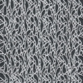](fouche_3x4/large/3x4_396_PFI-snowstorm.jpg)  |  GF:[snowstorm]  Inkscape:<a href="fouche_3x4/thumbnail/3x4_396.txt" download="3x4_396.txt">3x4_396</a>

[trellis]: /GroundForge/tiles?patchWidth=15&patchHeight=15&c1=ctct&a1=ctct&d2=ctct&a2=ctct&d3=ctct&b3=ctct&tile=0z5-,8--5,v9-4&footsideStitch=ctctt&tileStitch=ctct&headsideStitch=ctctt&shiftColsSW=0&shiftRowsSW=3&shiftColsSE=4&shiftRowsSE=3

[mother &#38; babe]: /GroundForge/tiles?patchWidth=15&patchHeight=15&d1=ctct&c1=ctct&b1=ctct&a1=ctct&d2=ctct&c2=ctct&a2=ctct&d3=ctct&c3=ctct&b3=ctct&tile=6637,4v89,z501,&footsideStitch=ctctt&tileStitch=ctct&headsideStitch=ctctt&shiftColsSW=0&shiftRowsSW=3&shiftColsSE=4&shiftRowsSE=3

[trail and stripes]: /GroundForge/tiles?patchWidth=15&patchHeight=15&c1=ctct&b1=ctct&a1=ctct&d2=ctctctct&b2=ctctctct&d3=ctct&c3=ctct&a3=ctct&tile=866v,z4-0,0z01,,&footsideStitch=ctctt&tileStitch=ctct&headsideStitch=ctctt&shiftColsSW=0&shiftRowsSW=3&shiftColsSE=4&shiftRowsSE=3

[flying squirrel]: /GroundForge/tiles?patchWidth=15&patchHeight=15&c1=ctct&b1=ctct&a1=ctct&c2=ctct&b2=ctct&a2=ctct&d3=ctct&b3=ctct&tile=586-,468-,-4-5,&footsideStitch=ctctt&tileStitch=ctct&headsideStitch=ctctt&shiftColsSW=0&shiftRowsSW=3&shiftColsSE=4&shiftRowsSE=3

[coral]: /GroundForge/tiles?patchWidth=15&patchHeight=15&d1=ctct&c1=ctct&a1=ctct&c2=ctct&b2=ctct&a2=ctct&c3=ctctctct&b3=ctct&a3=ctctctct&tile=4v99,700z,437-&footsideStitch=ctctt&tileStitch=ctct&headsideStitch=ctctt&shiftColsSW=0&shiftRowsSW=3&shiftColsSE=4&shiftRowsSE=3

[updog]: /GroundForge/tiles?patchWidth=15&patchHeight=15&c1=ctct&a1=ctct&c2=ctct&b2=ctct&c3=ctct&b3=ctct&a3=ctctctct&tile=8x7v,x78-,401z&footsideStitch=ctctt&tileStitch=ctct&headsideStitch=ctctt&shiftColsSW=0&shiftRowsSW=3&shiftColsSE=4&shiftRowsSE=3

[bikini-top]: /GroundForge/tiles?patchWidth=15&patchHeight=15&d1=ctctl&c1=ctctl&a1=ctctl&d2=cttctt&b2=cttctt&c3=ctct&b3=ctct&a3=ctct&tile=6v86,-5v8,210z&footsideStitch=ctctt&tileStitch=ctct&headsideStitch=ctctt&shiftColsSW=0&shiftRowsSW=3&shiftColsSE=4&shiftRowsSE=3

[rain]: /GroundForge/tiles?patchWidth=15&patchHeight=15&c1=rctc&b1=tctc&a1=llctc&c2=rrlctc&b2=rrlctc&a2=lctc&d3=rctc&b3=rctc&a3=rctc&tile=430z,688v,00z0&footsideStitch=ctctt&tileStitch=ctct&headsideStitch=ctctt&shiftColsSW=0&shiftRowsSW=3&shiftColsSE=4&shiftRowsSE=3

[cut-diamond]: /GroundForge/tiles?patchWidth=15&patchHeight=15&d1=ctct&b1=cttctt&a1=ctct&c2=tctct&b2=cttctt&a2=ctct&c3=ctct&b3=pctct&a3=ctct&tile=85v9,170z,148-&footsideStitch=ctctt&tileStitch=ctct&headsideStitch=ctctt&shiftColsSW=0&shiftRowsSW=3&shiftColsSE=4&shiftRowsSE=3

[dragonfly]: /GroundForge/tiles?patchWidth=15&patchHeight=15&d1=ctcr&c1=ctc&b1=ctct&a1=ctctl&c2=ctctr&b2=ctctr&d3=ctc&a3=ctct&tile=8868,x14-,4x-2&footsideStitch=ctctt&tileStitch=ctct&headsideStitch=ctctt&shiftColsSW=0&shiftRowsSW=3&shiftColsSE=4&shiftRowsSE=3

[clamshell-edge]: /GroundForge/tiles?patchWidth=15&patchHeight=16&d1=ct&c1=ctct&b1=ctctctct&a1=ctct&d2=ct&c2=ctct&b2=ct&a2=ctctl&d3=ct&b3=ct&tile=1158,8864,x4-7&footsideStitch=ctctt&tileStitch=ctct&headsideStitch=ctctt&shiftColsSW=0&shiftRowsSW=3&shiftColsSE=4&shiftRowsSE=3

[archer]: /GroundForge/tiles?patchWidth=15&patchHeight=16&d1=ctctctctr&c1=ctctl&b1=ctctctctl&d2=cttctt&b2=ct&a2=ct&d3=ctctctct&c3=ctct&b3=ct&a3=ct&tile=-464,56-7,4868&footsideStitch=ctctt&tileStitch=ctct&headsideStitch=ctctt&shiftColsSW=0&shiftRowsSW=3&shiftColsSE=4&shiftRowsSE=3

[swimming up the waterfall]: /GroundForge/tiles?patchWidth=20&patchHeight=21&d1=ct&b1=ct&a1=ct&d2=ct&c2=ct&b2=ct&a2=ct&d3=ct&c3=ct&b3=ct&a3=ct&tile=46v6,2731,3217&footsideStitch=ctctt&tileStitch=ctct&headsideStitch=ctctt&shiftColsSW=0&shiftRowsSW=3&shiftColsSE=4&shiftRowsSE=3

[deco]: /GroundForge/tiles?patchWidth=16&patchHeight=21&d1=ctct&c1=ctct&b1=ctct&a1=ctct&d2=ctct&c2=ctct&b2=ctct&a2=ctct&d3=ctct&b3=ctct&tile=4868,8468,x4-4&footsideStitch=ctctt&tileStitch=ctct&headsideStitch=ctctt&shiftColsSW=0&shiftRowsSW=3&shiftColsSE=4&shiftRowsSE=3

[mandible]: /GroundForge/tiles?patchWidth=16&patchHeight=21&d1=ctct&c1=ct&b1=ct&a1=ctctctct&d2=ctct&c2=ct&b2=ct&a2=ctct&d3=ctctctct&c3=ct&b3=ct&a3=ctct&tile=7999,4668,0004&footsideStitch=ctctt&tileStitch=ct&headsideStitch=ctctt&shiftColsSW=0&shiftRowsSW=3&shiftColsSE=4&shiftRowsSE=3

[nouveau]: /GroundForge/tiles?patchWidth=16&patchHeight=21&d1=cttctt&c1=ct&b1=ct&a1=cttctt&d2=cttctt&c2=ct&b2=cttctt&c3=ct&b3=ct&a3=ct&tile=1279,v954,044-&footsideStitch=ctctt&tileStitch=ct&headsideStitch=ctctt&shiftColsSW=0&shiftRowsSW=3&shiftColsSE=4&shiftRowsSE=3

[sleet]: /GroundForge/tiles?patchWidth=16&patchHeight=21&d1=ct&b1=ct&a1=ctct&c2=ct&b2=ct&a2=ct&d3=ct&c3=ctct&b3=ct&a3=ct&tile=46-4,486x,8488&footsideStitch=ctctt&tileStitch=ct&headsideStitch=ctctt&shiftColsSW=0&shiftRowsSW=3&shiftColsSE=4&shiftRowsSE=3

[Jacob's ladder]: /GroundForge/tiles?patchWidth=16&patchHeight=21&d1=ct&c1=cttctt&b1=ct&a1=ctct&d2=ct&c2=cttctt&b2=ct&a2=ctct&d3=ct&c3=cttctt&b3=ct&a3=ctct&tile=4637,4637,7432&footsideStitch=ctctt&tileStitch=ct&headsideStitch=ctctt&shiftColsSW=0&shiftRowsSW=3&shiftColsSE=4&shiftRowsSE=3

[snowstorm]: /GroundForge/tiles?patchWidth=16&patchHeight=21&d1=ctct&c1=ctct&b1=ctct&a1=ctct&d2=ctct&c2=ctct&b2=ctct&a2=ctct&d3=ctct&c3=ctct&b3=ctct&a3=ctct&tile=4648,0144,7997&footsideStitch=ctctt&tileStitch=ctct&headsideStitch=ctctt&shiftColsSW=0&shiftRowsSW=3&shiftColsSE=4&shiftRowsSE=3

[Greek waves]: /GroundForge/tiles?patchWidth=16&patchHeight=21&d1=ctctctcr&c1=ctc&b1=ctc&a1=ctc&d2=ctc&c2=ctc&b2=ctctctc&a2=ctctctct&d3=ct&c3=ct&b3=ct&tile=0117,8466,v974&footsideStitch=ctctt&tileStitch=ctct&headsideStitch=ctctt&shiftColsSW=0&shiftRowsSW=3&shiftColsSE=4&shiftRowsSE=3

[bell pepper]: /GroundForge/tiles?patchWidth=20&patchHeight=20&d1=ctcrctc&c1=ctclctc&b1=ctcrctc&a1=ctc&d2=ctt&c2=ctcrctc&b2=ctc&a2=ctclctcll&d3=ctc&c3=ctc&b3=ctclctc&a3=ctt&tile=4604,4887,7488&footsideStitch=ctctt&tileStitch=ctct&headsideStitch=ctctt&shiftColsSW=0&shiftRowsSW=3&shiftColsSE=4&shiftRowsSE=3

[wasp nest]: /GroundForge/tiles?patchWidth=16&patchHeight=17&d1=ctc&c1=ctc&b1=ct&a1=ctcrctcr&d2=ctc&c2=ctcrctcl&b2=ct&a2=ct&d3=ctc&c3=ctc&b3=ctctct&a3=ct&tile=8748,1174,1748&footsideStitch=ctctt&tileStitch=ct&headsideStitch=ctctt&shiftColsSW=0&shiftRowsSW=3&shiftColsSE=4&shiftRowsSE=3

[mantis]: /GroundForge/tiles?patchWidth=20&patchHeight=20&d1=ctc&c1=ctc&b1=ctc&a1=ctc&d2=ctcll&c2=ctcrr&b2=ctctt&a2=ctctt&d3=ctc&c3=ctc&b3=ctc&a3=crrcllcrrcllcrrcllctt&tile=4664,9277,4466&footsideStitch=ctctt&tileStitch=ctct&headsideStitch=ctctt&shiftColsSW=0&shiftRowsSW=3&shiftColsSE=4&shiftRowsSE=3
