[TesseLace.com]: https://tesselace.com
[GroundForge]: /GroundForge/tiles.html

TesseLace Index
==================
+ [Traditional grounds](#traditional-grounds)
   + [cloth](#cloth-family)
   + [diamond](#diamond-family)
   + [kat or Paris](#kat-or-paris-family)
   + [rose](#rose-family)
   + [bias](#bias-family)
+ [Non-traditional grounds](#non-traditional-grounds)

The grounds that appear in the TesseLace index are the result of research by [Veronika Irvine](https://tesselace.com/about) and were generated using the [TesseLace algorithm](https://tesselace.com/research/bridges2012/).  Some of these grounds are familiar, traditional grounds.  Others have not been found in known catalogues and are likely new.

In the following tables, 
* click on the **image** to see thread and pair diagrams in [GroundForge],
* click on the **name** to download a template file for use with the [Bobbin Lace plugins for Inkscape](https://tesselace.com/tools/inkscape-extension/).

Families of patterns are variations of the same pattern with [modified pin positions](/GroundForge/help/Reshape-Patterns).  Note: Currently, GroundForge does not support pin positions therefore the thread diagrams for all members of a family look the same.
   
Traditional Grounds
-------------------

### Cloth family

|     |     |     |     |     |
|:---|:---|:---|:---|:---|
[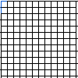][2x1_1] | [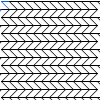][2x1_3] | [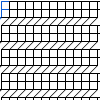][3x1_1] | [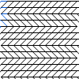][5x1_20]
<a href="tl/cloth/2x1_1.txt" download="2x1_1.txt">2x1_1</a> | <a href="tl/cloth/2x1_3.txt" download="2x1_3.txt">2x1_3</a> | <a href="tl/cloth/3x1_1.txt" download="3x1_1.txt">3x1_1</a> | <a href="tl/cloth/5x1_20.txt" download="5x1_20.txt">5x1_20</a>

### Diamond family

|     |     |     |     |     |
|:---|:---|:---|:---|:---|
[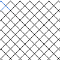][2x2_3] | [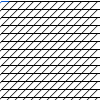][1x1_1] | [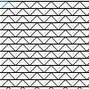][1x2_1] | [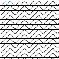][1x3_1] | [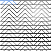][1x4_2]
<a href="tl/4/2x2_3.txt" download="2x2_3.txt">2x2_3</a> | <a href="tl/4/1x1_1.txt" download="1x1_1.txt">1x1_1</a> | <a href="tl/4/1x2_1.txt" download="1x2_1.txt">1x2_1</a> | <a href="tl/4/1x3_1.txt" download="1x3_1.txt">1x3_1</a> | <a href="tl/4/1x4_2.txt" download="1x4_2.txt">1x4_2</a>
[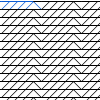][1x5_1] | [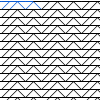][1x5_2] | [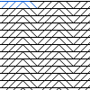][1x5_3] | [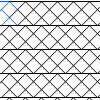][3x2_26] | [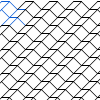][3x3_19]
<a href="tl/4/1x5_1.txt" download="1x5_1.txt">1x5_1</a> | <a href="tl/4/1x5_2.txt" download="1x5_2.txt">1x5_2</a> | <a href="tl/4/1x5_3.txt" download="1x5_3.txt">1x5_3</a> | <a href="tl/4/3x2_26.txt" download="3x2_26.txt">3x2_26</a> | <a href="tl/4/3x3_19.txt" download="3x3_19.txt">3x3_19</a>
[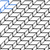][3x3_107] | [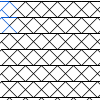][4x2_120] | [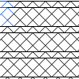][4x2_170] | [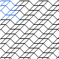][4x4_33] | [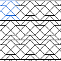][4x4_93]
<a href="tl/4/3x3_107.txt" download="3x3_107.txt">3x3_107</a> | <a href="tl/4/4x2_120.txt" download="4x2_120.txt">4x2_120</a> | <a href="tl/4/4x2_170.txt" download="4x2_170.txt">4x2_170</a> | <a href="tl/4/4x4_33.txt" download="4x4_33.txt">4x4_33</a> | <a href="tl/4/4x4_93.txt" download="4x4_93.txt">4x4_93</a>
See also  [MAE-gf nets](https://maetempels.github.io/MAE-gf/docs/nets#diagonal-net) |
 
### Kat or Paris family

|     |     |     |     |     |
|:---|:---|:---|:---|:---|
[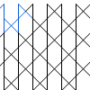][kat]  | [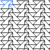][2x4_8] | [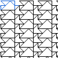][2x4_18] | [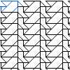][2x4_28] | [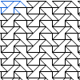][2x4_29]
  <a href="tl/3_6/kat.txt" download="kat.txt">2x4_8</a> | <a href="tl/3_6/2x4_8.txt" download="2x4_8.txt">2x4_8</a> | <a href="tl/3_6/2x4_18.txt" download="2x4_18.txt">2x4_18</a> | <a href="tl/3_6/2x4_28.txt" download="2x4_28.txt">2x4_28</a> | <a href="tl/3_6/2x4_29.txt" download="2x4_29.txt">2x4_29</a>
[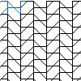][2x4_49] | [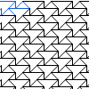][2x4_86] | [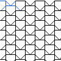][2x4_93] | [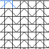][2x4_96] | [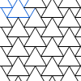][R3M3_6x6_1]
<a href="tl/3_6/2x4_49.txt" download="2x4_49.txt">2x4_49</a>  | <a href="tl/3_6/2x4_86.txt" download="2x4_86.txt">2x4_86</a> | <a href="tl/3_6/2x4_93.txt" download="2x4_93.txt">2x4_93</a> |  <a href="tl/3_6/2x4_96.txt" download="2x4_96.txt">2x4_96</a> | <a href="tl/3_6/R3M3_6x6_1.txt" download="R3M3_6x6_1.txt">R3M3_6x6_1</a> | 
 See also  [MAE-gf Paris](https://maetempels.github.io/MAE-gf/docs/paris) | 
 
Close cousin:

|     |     |     |     |     |
|:---|:---|:---|:---|:---|
[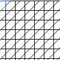][2x2_5] |  
 <a href="tl/3_6/2x2_5.txt" download="2x2_5.txt">2x2_5</a> |   | 
 
### Rose family

|     |     |     |     |     |
|:---|:---|:---|:---|:---|
[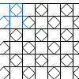][rose] |  [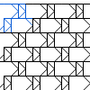][4x4_25309] |  [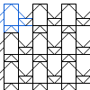][4x4_117397] |  [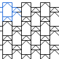][4x4_117301] | See also  [MAE-gf Roses](https://maetempels.github.io/MAE-gf/docs/roses)   [Droste effect](/GroundForge/Droste-effect)
 <a href="tl/3_4_8/rose.txt" download="rose.txt">rose</a> |  <a href="tl/3_4_8/4x4_25309.txt" download="4x4_25309.txt">4x4_25309</a> |  <a href="tl/3_4_8/4x4_117397.txt" download="4x4_117397.txt">4x4_117397</a> | <a href="tl/3_4_8/4x4_117301.txt" download="4x4_117301.txt">4x4_117301</a>
 

Close cousins:

|     |     |     |     |     |
|:---|:---|:---|:---|:---|
[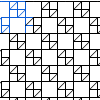][4x4_56] | [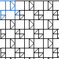][4x4_71] | [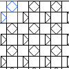][4x4_102] |  [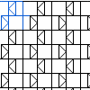][4x4_105] |  [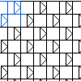][4x4_106]
 | <a href="tl/3_4_8/4x4_56.txt" download="4x4_56.txt">4x4_56</a> | <a href="tl/3_4_7_8/4x4_71.txt" download="4x4_71.txt">4x4_71</a> | <a href="tl/3_4_7_8/4x4_102.txt" download="4x4_102.txt">4x4_102</a> | <a href="tl/3_4_7/4x4_105.txt" download="4x4_105.txt">4x4_105</a> | <a href="tl/3_4_7/4x4_106.txt" download="4x4_106.txt">4x4_106</a>
[][4x4_19737] |  [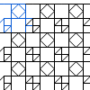][4x4_22317] |
 <a href="tl/3_4_8/4x4_19737.txt" download="4x4_19737.txt">4x4_19737</a> |  <a href="tl/3_4_8/4x4_22317.txt" download="4x4_22317.txt">4x4_22317</a>
 
### Bias family

|     |     |     |     |     |
|:---|:---|:---|:---|:---|
[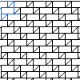][3x3_248] | [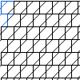][4x2_97] | [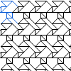][4x3_267] |  | See also  [MAE-gf bias](https://maetempels.github.io/MAE-gf/docs/bias)
<a href="tl/3_6/3x3_248.txt" download="3x3_248.txt">3x3_248</a> | <a href="tl/3_6/4x2_97.txt" download="4x2_97.txt">4x2_97</a> | <a href="tl/3_6/4x3_267.txt" download="4x3_267.txt">4x3_267</a> |

Non-traditional grounds
-----------------------

The non-traditional grounds have been grouped based on the size of the largest hole in the ground.

* [Pentagon](5.md)
* [Hexagon](6.md)
* [Heptagon](7.md)
* [Octagon](8_9_10.md#8)
* [Nonagon](8_9_10.md#9)
* [Decagon](8_9_10.md#10) 

[2x1_1]: /GroundForge/tiles.html?patchWidth=12&patchHeight=12&tile=8,1&shiftColsSW=0&shiftRowsSW=2&shiftColsSE=1&shiftRowsSE=0&
[2x1_3]: /GroundForge/tiles.html?patchWidth=12&patchHeight=12&tile=6,2&shiftColsSW=0&shiftRowsSW=2&shiftColsSE=1&shiftRowsSE=0&
[3x1_1]: /GroundForge/tiles.html?patchWidth=12&patchHeight=12&tile=6,8,1&shiftColsSW=0&shiftRowsSW=3&shiftColsSE=1&shiftRowsSE=0&
[5x1_20]: /GroundForge/tiles.html?patchWidth=12&patchHeight=12&tile=6,6,6,2,2&shiftColsSW=0&shiftRowsSW=5&shiftColsSE=1&shiftRowsSE=0&

[1x1_1]: /GroundForge/tiles.html?patchWidth=12&patchHeight=12&tile=6&shiftColsSW=0&shiftRowsSW=1&shiftColsSE=1&shiftRowsSE=0&
[1x2_1]: /GroundForge/tiles.html?patchWidth=12&patchHeight=12&tile=53&shiftColsSW=0&shiftRowsSW=1&shiftColsSE=2&shiftRowsSE=0&
[1x3_1]: /GroundForge/tiles.html?patchWidth=12&patchHeight=12&tile=563&shiftColsSW=0&shiftRowsSW=1&shiftColsSE=3&shiftRowsSE=0&
[1x4_2]: /GroundForge/tiles.html?patchWidth=12&patchHeight=12&tile=5632&shiftColsSW=0&shiftRowsSW=1&shiftColsSE=4&shiftRowsSE=0&
[1x5_1]: /GroundForge/tiles.html?patchWidth=12&patchHeight=12&tile=56663&shiftColsSW=0&shiftRowsSW=1&shiftColsSE=5&shiftRowsSE=0&
[1x5_2]: /GroundForge/tiles.html?patchWidth=12&patchHeight=12&tile=56353&shiftColsSW=0&shiftRowsSW=1&shiftColsSE=5&shiftRowsSE=0&
[1x5_3]: /GroundForge/tiles.html?patchWidth=12&patchHeight=12&tile=56632&shiftColsSW=0&shiftRowsSW=1&shiftColsSE=5&shiftRowsSE=0&
[2x2_3]: /GroundForge/tiles.html?patchWidth=12&patchHeight=12&tile=5-,-5&shiftColsSW=0&shiftRowsSW=2&shiftColsSE=2&shiftRowsSE=0&
[3x3_19]: /GroundForge/tiles.html?patchWidth=12&patchHeight=12&tile=56-,6-5,-56&shiftColsSW=0&shiftRowsSW=3&shiftColsSE=3&shiftRowsSE=0&
[3x2_26]: /GroundForge/tiles.html?patchWidth=12&patchHeight=12&tile=53,5-,-5&shiftColsSW=0&shiftRowsSW=3&shiftColsSE=2&shiftRowsSE=0&
[3x3_107]: /GroundForge/tiles.html?patchWidth=12&patchHeight=12&tile=4-L,-L4,L4-&shiftColsSW=0&shiftRowsSW=3&shiftColsSE=3&shiftRowsSE=0&
[4x4_33]: /GroundForge/tiles.html?patchWidth=12&patchHeight=12&tile=566-,66-5,6-56,-566&shiftColsSW=0&shiftRowsSW=4&shiftColsSE=4&shiftRowsSE=0&
[4x4_93]: /GroundForge/tiles.html?patchWidth=12&patchHeight=12&tile=5632,56-2,5-5-,-535&shiftColsSW=0&shiftRowsSW=4&shiftColsSE=4&shiftRowsSE=0&
[4x2_120]: /GroundForge/tiles.html?patchWidth=12&patchHeight=12&tile=53,5-,35,-5&shiftColsSW=0&shiftRowsSW=4&shiftColsSE=2&shiftRowsSE=0&
[4x2_170]: /GroundForge/tiles.html?patchWidth=12&patchHeight=12&tile=53,53,5-,-5&shiftColsSW=0&shiftRowsSW=4&shiftColsSE=2&shiftRowsSE=0&

[2x2_5]: /GroundForge/tiles.html?patchWidth=12&patchHeight=12&tile=68,-4&shiftColsSW=0&shiftRowsSW=2&shiftColsSE=2&shiftRowsSE=0&

[kat]: /GroundForge/tiles.html?patchWidth=12&patchHeight=12&tile=B-C-,---5,C-B-,-5--&shiftColsSW=0&shiftRowsSW=4&shiftColsSE=4&shiftRowsSE=0& 
[R3M3_6x6_1]: /GroundForge/tiles.html?patchWidth=12&patchHeight=12&tile=5-O-E-,-E-5-O&shiftColsSW=0&shiftRowsSW=2&shiftColsSE=6&shiftRowsSE=0&
[2x4_18]: /GroundForge/tiles.html?patchWidth=12&patchHeight=12&tile=4-J4,35-7&shiftColsSW=0&shiftRowsSW=2&shiftColsSE=4&shiftRowsSE=0&
[2x4_28]: /GroundForge/tiles.html?patchWidth=12&patchHeight=12&tile=4-L8,25-1&shiftColsSW=0&shiftRowsSW=2&shiftColsSE=4&shiftRowsSE=0&
[2x4_29]: /GroundForge/tiles.html?patchWidth=12&patchHeight=12&tile=4-M9,25E-&shiftColsSW=0&shiftRowsSW=2&shiftColsSE=4&shiftRowsSE=0&
[2x4_49]: /GroundForge/tiles.html?patchWidth=12&patchHeight=12&tile=68-7,-124&shiftColsSW=0&shiftRowsSW=2&shiftColsSE=4&shiftRowsSE=0&
[2x4_8]: /GroundForge/tiles.html?patchWidth=12&patchHeight=12&tile=5-M9,-50F&shiftColsSW=0&shiftRowsSW=2&shiftColsSE=4&shiftRowsSE=0&
[2x4_85]: /GroundForge/tiles.html?patchWidth=12&patchHeight=12&tile=4-O0,9E-7&shiftColsSW=0&shiftRowsSW=2&shiftColsSE=4&shiftRowsSE=0&
[2x4_86]: /GroundForge/tiles.html?patchWidth=12&patchHeight=12&tile=4-O0,O04-&shiftColsSW=0&shiftRowsSW=2&shiftColsSE=4&shiftRowsSE=0&
[2x4_93]: /GroundForge/tiles.html?patchWidth=12&patchHeight=12&tile=58-1,-158&shiftColsSW=0&shiftRowsSW=2&shiftColsSE=4&shiftRowsSE=0&
[2x4_96]: /GroundForge/tiles.html?patchWidth=12&patchHeight=12&tile=5831,-4-7&shiftColsSW=0&shiftRowsSW=2&shiftColsSE=4&shiftRowsSE=0&

[rose]: /GroundForge/tiles.html?patchWidth=12&patchHeight=12&tile=5831,-4-7,3158,-7-4&shiftColsSW=0&shiftRowsSW=4&shiftColsSE=4&shiftRowsSE=0&
[4x4_25309]: /GroundForge/tiles.html?patchWidth=12&patchHeight=12&tile=4830,--77,3048,77--&shiftColsSW=0&shiftRowsSW=4&shiftColsSE=4&shiftRowsSE=0&
[4x4_117397]: /GroundForge/tiles.html?patchWidth=12&patchHeight=12&tile=437-,4-7-,8-15,8315&shiftColsSW=0&shiftRowsSW=4&shiftColsSE=4&shiftRowsSE=0&
[4x4_117301]: /GroundForge/tiles.html?patchWidth=12&patchHeight=12&tile=437-,4-73,7-43,734-&shiftColsSW=0&shiftRowsSW=4&shiftColsSE=4&shiftRowsSE=0&
[4x4_19737]: /GroundForge/tiles.html?patchWidth=12&patchHeight=12&tile=4831,-4-7,3158,88-4&shiftColsSW=0&shiftRowsSW=4&shiftColsSE=4&shiftRowsSE=0&
[4x4_22317]: /GroundForge/tiles.html?patchWidth=12&patchHeight=12&tile=4831,-117,3178,88-4&shiftColsSW=0&shiftRowsSW=4&shiftColsSE=4&shiftRowsSE=0&
[4x4_56]: /GroundForge/tiles.html?patchWidth=12&patchHeight=12&tile=4831,-488,3148,88-4&shiftColsSW=0&shiftRowsSW=4&shiftColsSE=4&shiftRowsSE=0&
[4x4_71]: /GroundForge/tiles.html?patchWidth=12&patchHeight=12&tile=4831,---7,3AB8,88-4&shiftColsSW=0&shiftRowsSW=4&shiftColsSE=4&shiftRowsSE=0&
[4x4_102]: /GroundForge/tiles.html?patchWidth=12&patchHeight=12&tile=B83A,-4-7,3158,-7--&shiftColsSW=0&shiftRowsSW=4&shiftColsSE=4&shiftRowsSE=0&
[4x4_105]: /GroundForge/tiles.html?patchWidth=12&patchHeight=12&tile=B83A,-4--,31CD,-7--&shiftColsSW=0&shiftRowsSW=4&shiftColsSE=4&shiftRowsSE=0&
[4x4_106]: /GroundForge/tiles.html?patchWidth=12&patchHeight=12&tile=B83A,---7,3AB8,-7--&shiftColsSW=0&shiftRowsSW=4&shiftColsSE=4&shiftRowsSE=0&
 
[3x3_248]: /GroundForge/tiles.html?patchWidth=12&patchHeight=12&tile=483,348,834&shiftColsSW=0&shiftRowsSW=3&shiftColsSE=3&shiftRowsSE=0&
[4x2_97]: /GroundForge/tiles.html?patchWidth=12&patchHeight=12&tile=68,4-,86,-4&shiftColsSW=0&shiftRowsSW=4&shiftColsSE=2&shiftRowsSE=0&
[4x3_267]: /GroundForge/tiles.html?patchWidth=12&patchHeight=12&tile=5-O,25-,430,-17&shiftColsSW=0&shiftRowsSW=4&shiftColsSE=3&shiftRowsSE=0&